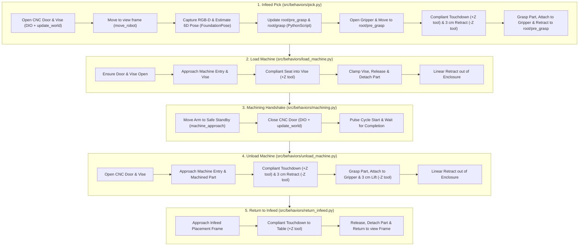

# Open Machine Tending Solution (OMTS)

[](https://github.com/intrinsic-ai/intrinsic-omts/actions/workflows/ci.yml)

**OMTS** is the open-source reference implementation for automated machine
tending (CNC milling, turning, fixture loading, and vision-guided manipulation)
built on **Intrinsic Core** using the **Solution Building Library (SBL)** Python
SDK. See [`docs/ARCHITECTURE.md`](docs/ARCHITECTURE.md) for system boundaries,
grasp geometry math, and the 5-subtree sequence diagram.

---

## 1. Execution Pipeline Overview

OMTS executes the complete perception-to-manipulation cycle inside a single SBL
`BehaviorTree` wrapped in `bt.Loop` for single-cycle, multi-cycle, or continuous
operation:



---

## 2. Repository Layout

```text
omts/
├── .bazelrc                             # Compiler flags, toolchains, and CUDA settings
├── .bazelversion                        # Pinned Bazel version (8.x)
├── MODULE.bazel                         # Bzlmod dependencies (@intrinsic-core, @intrinsic_apis)
├── BUILD                                # Defines intrinsic_solution(:omts_solution)
├── configs/                             # Cell YAML configs, .pbtxt updates & service manifests
│   ├── common/                          # Shared service configs & asset manifests
│   ├── omts/                            # Production cell (UR5e, CNC enclosure, Schunk vise)
│   ├── lab_bb_01/                       # Lab cell (UR3e, CAW enclosure, no CNC/vise)
│   └── kr_10/                           # KUKA KR10 placeholder config
├── models/                              # SDF/GLB 3D scene assets & manifests
├── src/                                 # Main OMTS Python package (//src:omts_app)
│   ├── main.py                          # Application CLI entrypoint
│   ├── core/                            # Domain models, infeed strategies & YAML config
│   ├── behaviors/                       # Master Behavior Tree & 5 cycle subtrees
│   ├── hardware/                        # Robot, Gripper, Machine & Vision SBL adapters
│   ├── utils/                           # Dynamic frame calculator & script/math helpers
│   └── foundationpose/                  # Triton config & Bazel MLModel packaging for FoundationPose
├── third_party/                         # C++/CUDA bindings, model.py & deps for FoundationPose
├── tools/                               # Commissioning, calibration, jogging & world CLI tools
└── tests/                               # Offline hermetic unit test suite (21 test targets)
```

---

## 3. Prerequisites & Workspace Setup

Bazel fetches **Intrinsic Core** automatically via [`MODULE.bazel`](MODULE.bazel),
so no manual `intrinsic-core` checkout is required:

```python
bazel_dep(name="intrinsic-core")
git_override(
  module_name="intrinsic-core",
  commit=INTRINSIC_CORE_COMMIT,
  remote=INTRINSIC_CORE_REMOTE,
)

bazel_dep(name="intrinsic_apis", version="0.0.1")
git_override(
  module_name="intrinsic_apis",
  commit=INTRINSIC_CORE_COMMIT,
  remote=INTRINSIC_CORE_REMOTE,
  strip_prefix="intrinsic_apis",
)
```

Two host prerequisites are required:

1. **Git LFS**: Intrinsic Core stores meshes, textures, and model weights in Git
   LFS. Install the smudge filter globally before building:
   ```bash
   sudo apt-get install git-lfs
   git lfs install
   ```
2. **GitHub Authentication**: Authenticate with `gh` if accessing private staging
   repositories:
   ```bash
   gh auth login
   gh auth setup-git
   ```

To move to a different Intrinsic Core revision, update `INTRINSIC_CORE_COMMIT`
in `MODULE.bazel`. The commit behind a release tag can be resolved with:

```bash
git ls-remote https://github.com/intrinsic-ai/ioc-staging.git 'refs/tags/<tag>^{}'
```

> [!NOTE]
> Once `intrinsic-core` is public, the read-access requirement disappears and
> the `git_override` definitions can be replaced with an `archive_override`
> against a published release archive, which is faster and checksum-pinned.

---

## 4. Build & Run Instructions

### 1. Deploy the Workcell Solution

Build and launch the ICON controller, hardware modules, perception services, and
simulator:

```bash
# Deploy default OMTS cell (UR5e + CNC enclosure + Schunk vise):
bazel run //:omts_solution -c opt -- --address=localhost:17080

# Deploy Lab BB-01 cell (UR3e + CAW enclosure, no CNC machine):
bazel run //:omts_solution -c opt --//:setup=lab_bb_01 -- --address=localhost:17080
```

### 2. Apply Scene Updates (Simulation / Fresh Deployment)

Push kinematic attachments, robot base alignment, and scene frames to the live
`ObjectWorld` (pass `--reset_sim` to synchronize Gazebo's `sim_world`):

```bash
bazel run //tools/world:apply_scene_updates -- \
  --address=localhost:17080 \
  --reset_sim
```

### 3. Register & Verify Pose Estimator (Required before running `omts_app`)

Register the FoundationPose estimator for the raw stock workpiece before
starting the machine tending application:

```bash
bazel run //tools/pose_estimation:register_using_train_service -- \
  --address="localhost:17080" \
  --scene_object_id="ai.intrinsic.raw_stock_2x3x5" \
  --pose_estimator_id="ai.intrinsic.raw_stock_2x3x5_estimator" \
  --refinement_iters=6 \
  --confidence_threshold=0.6 \
  --visibility_threshold=0.6
```

Optionally verify pose detection directly against the live camera feed:

```bash
bazel run //tools/pose_estimation:run_pose_estimation -- \
  --address=localhost:17080 \
  --pose_estimator_id=ai.intrinsic.raw_stock_2x3x5_estimator
```

### 4. Run the OMTS Machine Tending Application

Connect to the running deployment and execute the machine tending Behavior Tree:

```bash
# Run with default OMTS cell configuration:
bazel run //src:omts_app -- \
  --address=localhost:17080 \
  --config="configs/omts/app_config.yaml"

# Run with Lab BB-01 cell configuration:
bazel run //src:omts_app -- \
  --address=localhost:17080 \
  --config="configs/lab_bb_01/app_config.yaml"

# Override cycle count (e.g. 3 cycles, or 0 for continuous loop) and execution mode:
bazel run //src:omts_app -- \
  --address=localhost:17080 \
  --config="configs/omts/app_config.yaml" \
  --num_cycles=3 \
  --simulation_mode=fast_preview
```

---

## 5. Testing & Developer Tools

### Unit Tests

Run all 21 hermetic unit test suites offline (no running cluster or physical
hardware required):

```bash
bazel test //tests/...
```

### Operational & Diagnostic CLI Tools

See [`tools/README.md`](tools/README.md) for the full reference. Common commands:

```bash
# Inspect live world kinematic tree, frames, and joint states:
bazel run //tools/world:inspect_world -- --address=localhost:17080

# Interactive robot jogging:
bazel run //tools/jogging:jog_interactive -- --instance=icon --host=localhost --port=17080

# Move robot tool to a named scene frame:
bazel run //tools/jogging:move_to_frame -- --address=localhost:17080 --frame=view --motion_type=ANY

# Teach & persist current tool pose to scene.updates.pbtxt:
bazel run //tools/jogging:store_frame -- view --address=localhost:17080

# Control gripper (Robotiq or DIO):
bazel run //tools/gripper:control_gripper -- --address=localhost:17080 --action=open

# Control CNC machine doors, vise, and cycle signals:
bazel run //tools/machine:control_machine -- --address=localhost:17080 --action=open_door
```

---

## 6. Code Quality & Formatting

OMTS enforces formatting and linting checks on all pull requests via GitHub
Actions CI (`line-length = 80`, `indent-width = 2`):

```bash
# Auto-format Bazel (buildifier) and Python/Markdown (ruff) files:
./tools/format.sh

# Run CI lint and format verification checks locally:
./tools/lint.sh
```

---

## 7. Licensing Information for NVIDIA FoundationPose

OMTS uses the FoundationPose model by NVIDIA for RGB-D pose estimation.
FoundationPose is packaged into an `MlModelAsset` in
[`src/foundationpose/BUILD`](src/foundationpose/BUILD) and referenced in the
[`BUILD`](BUILD) file at build time by the user. The integration comprises two
components:

1. An orchestration library (`third_party/foundationpose/`) derived from
   NVIDIA's
   [Isaac ROS Pose Estimation Repository](https://github.com/NVIDIA-ISAAC-ROS/isaac_ros_pose_estimation),
   licensed under the Apache 2.0 License. See
   [`src/foundationpose/README.md`](src/foundationpose/README.md) for Bazel
   build and packaging details.
2. The FoundationPose model weights (`.onnx` files) are not included in this
   repository and are not covered by the Apache 2.0 License. They are downloaded
   at build time directly from NVIDIA's NGC catalog by the user (configured in
   [`third_party/foundationpose/deps.bzl`](third_party/foundationpose/deps.bzl)):
   - [refine_model.onnx](https://api.ngc.nvidia.com/v2/models/nvidia/isaac/foundationpose/versions/1.0.0_onnx/files/refine_model.onnx)
   - [score_model.onnx](https://api.ngc.nvidia.com/v2/models/nvidia/isaac/foundationpose/versions/1.0.0_onnx/files/score_model.onnx)
   - License: [NVIDIA Open Model License](https://www.nvidia.com/en-us/agreements/enterprise-software/nvidia-open-model-license/).

By building this project, you download the model weights directly from NVIDIA
and accept the NVIDIA Open Model License for those weights. Intrinsic does not
distribute these weights.


---

## Documentation and related repositories

* [**Intrinsic Developer Community**](https://developer.intrinsic.ai): Complete guides, interactive tutorials, and API references.

---

## Contributing and community

Contributions are welcome! Please review:

* [CONTRIBUTING.md](CONTRIBUTING.md): Details on signing the Google Contributor License Agreement (CLA), community guidelines, C++20 coding standards, and pull request workflows.  
* [SECURITY.md](SECURITY.md): Instructions for reporting security vulnerabilities.

---

## License

This project is licensed under the [Apache 2.0 License](LICENSE).

---

> **Disclaimer**: This is not an officially supported Google product.

---

### Trademark notice

"Intrinsic" and "Intrinsic Core" are trademarks of Intrinsic Innovation LLC. See [TRADEMARK.md](TRADEMARK.md) for usage guidelines.
