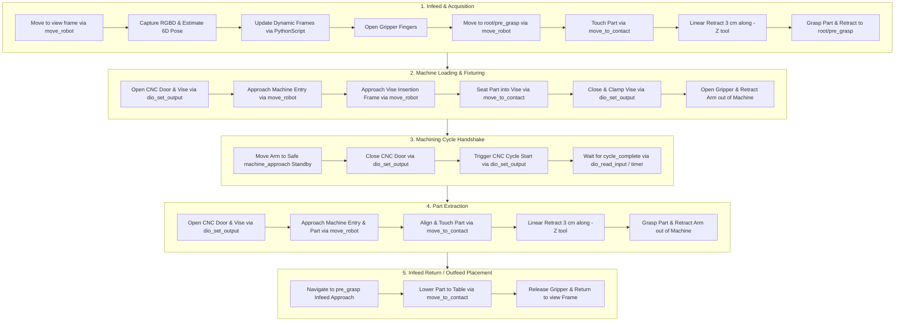

# Open Machine Tending Solution (OMTS)

[](https://github.com/intrinsic-ai/intrinsic-omts/actions/workflows/ci.yml)

OMTS is an open-source reference application for automated machine tending (e.g. CNC milling, turning, press braking, and fixture loading) built on top of **Intrinsic Open Core (IOC)** using the **Solution Building Library (SBL)** Python SDK.

---

## Documentation Guides

* [**Architecture & System Design**](docs/ARCHITECTURE.md): SBL abstractions, behavior tree lifecycle, infeed strategy pattern, and domain models.
* [**Extending Hardware & Real I/O**](docs/EXTENDING_HARDWARE.md): Guide for connecting real Robotiq grippers, pneumatic vises, CNC machine door interlocks, and 3D perception tracking.
* [**Developer Playbook & Operations**](docs/DEVELOPER_PLAYBOOK.md): Bazel execution, unit tests, diagnostic tools (`inspect_world`, `apply_scene_updates`, `move_to_frame`), and troubleshooting gotchas.

---

## 1. Solution Architecture & Execution Pipeline

OMTS orchestrates a complete machine tending cycle. It features a dual-infeed strategy supporting either **Vision-Guided Pick** (random part placement via 3D camera pose estimation) or **Blind Grid Pick** (deterministic pallet slot math).



---

## 2. Repository Layout

```
omts/
├── .bazelrc                             # Compiler flags, toolchains, and CUDA settings
├── .bazelversion                        # Pinned Bazel version (8.x)
├── MODULE.bazel                         # Bzlmod dependencies (ioc, toolchains, Skylib)
├── BUILD                                # Defines intrinsic_solution(:omts_solution) & aliases
│
├── configs/                             # Workcell Textproto / Pbtxt configurations
│
├── assets/                              # 3D models, meshes, and catalog assets
│   ├── meshes/                          # STL / GLB meshes (trays, CNC enclosure, raw stock)
│   └── raw_stock/                       # Raw stock metadata and bounding geometry
│
├── src/                                 # Main OMTS Python package
│   ├── main.py                          # Main OMTS application entrypoint
│   ├── core/                            # Domain models (Workpiece, Tray, WorkcellState)
│   ├── hardware/                        # Hardware adapters (Robot, Gripper, CNC Machine, Camera)
│   ├── behaviors/                       # Composable Behavior Tree subtrees & tasks
│   └── utils/                           # Math & coordinate transform utilities
│
├── tools/                               # Developer & operational CLI tools
│   ├── calibration/                     # Camera-to-robot & hand-eye calibration scripts
│   ├── gripper/                         # Gripper actuation CLI (Robotiq, DIO, sideloaded, mock)
│   ├── jogging/                         # Interactive robot teleoperation & pose teaching
│   ├── pose_estimation/                 # Pose estimator registration & inference scripts
│   └── world/                           # Scene updates, transform inspection & alignment
│
└── tests/                               # Test Suites
    ├── unit/                            # Offline unit tests (Mock SBL, tray math, domain state)
    └── e2e/                             # End-to-end simulation tests against Gazebo
```

---

## 3. Object-Oriented Design & SBL Abstractions

OMTS adheres to clean separation of concerns:

- **Domain Models (`src/core/`):** Represents manufacturing state (`Workpiece`, `PartState`, `TraySlot`, `WorkcellState`) independently from robot kinematics.
- **Hardware Adapters (`src/hardware/`):** Unified interfaces (`Robot`, `Gripper`, `Machine`, `VisionSensor`) wrapping low-level SBL gRPC stubs and allowing seamless substitution with mock objects during unit testing.
- **Infeed Strategy Pattern (`src/core/infeed.py`):** Encapsulates part acquisition logic:
  - `PerceptionInfeed`: Uses camera + pose estimation for unstructured / random part placement.
  - `GridInfeed`: Uses mathematical row/column indexing for structured tray pallets.
- **Composable Behavior Trees (`src/behaviors/`):** Modular factory functions returning standard `bt.Node` / `bt.SubTree` building blocks.

---

## 4. Prerequisites & Workspace Setup

Bazel fetches Intrinsic Open Core itself, so no manual `ioc` checkout is
required. The dependency is configured in [`MODULE.bazel`](MODULE.bazel) and
pinned to an immutable commit:

```python
bazel_dep(name="insrc", repo_name="ioc")
git_override(
  module_name="insrc",
  commit=IOC_COMMIT,
  remote="https://github.com/intrinsic-ai/ioc-staging.git",
)

bazel_dep(name="intrinsic_apis", version="0.0.1")
git_override(
  module_name="intrinsic_apis",
  commit=IOC_COMMIT,
  remote="https://github.com/intrinsic-ai/ioc-staging.git",
  strip_prefix="incode/intrinsic_apis",
)
```

Two host prerequisites follow from this:

1. **Git LFS.** IOC stores its meshes, textures and model weights in Git LFS.
   Bazel checks the repository out with plain `git`, so the smudge filter must
   be installed globally or the working tree will contain pointer files instead
   of real assets:

   ```bash
   sudo apt-get install git-lfs   # if not already present
   git lfs install
   ```

2. **Read access to `intrinsic-ai/ioc-staging`.** The repository is currently
   private. Any standard git credential setup works, for example:

   ```bash
   gh auth login
   gh auth setup-git
   ```

To move to a different IOC revision, update `IOC_COMMIT` in `MODULE.bazel`. The
commit behind a release tag can be resolved with:

```bash
git ls-remote https://github.com/intrinsic-ai/ioc-staging.git 'refs/tags/<tag>^{}'
```

> [!NOTE]
> Once `ioc` is public, the read-access requirement disappears and the
> `git_override` definitions can be replaced with an `archive_override` against
> a published release archive, which is faster and checksum-pinned.

---

## 5. Build & Run Instructions

### 1. Deploy the Workcell Solution

Deploy and start the ICON controller, robot hardware modules, camera drivers, and platform services:

```bash
# Deploy with default OMTS setup (UR5e + omts camera config):
bazel run //:omts_solution -c opt -- --address localhost:17080

# Deploy with Lab BB-01 setup (UR3e + lab_bb_01 camera config):
bazel run //:omts_solution -c opt --config=lab_bb_01 -- --address localhost:17080
```

### 2. Run the OMTS Python Application

Connect to the running deployment and execute the machine tending sequence:

```bash
# Run in Perception mode (3D vision-guided picking + Robotiq gripper):
bazel run //src:omts_app -- --address=localhost:17080 --infeed_mode=perception --gripper_type=robotiq

# Run in Blind Grid mode (deterministic tray slots):
bazel run //src:omts_app -- --address=localhost:17080 --infeed_mode=grid

# Run with an explicit executive execution mode
# (reality = full physics, preview, fast_preview):
bazel run //src:omts_app -- --address=localhost:17080 --simulation_mode=fast_preview
```

---

## 6. Testing & Developer Tools

### Unit Tests
Run offline unit tests (no physical cluster or robot required, covers 8 test suites):
```bash
bazel test //tests/unit:all
```

### Developer CLI Tools

- **Apply Scene & Attachment Updates Live (without restarting the solution):**
  ```bash
  # Push all default configs live (ur_module attachments, scene frames, align_robot):
  bazel run //tools/world:apply_scene_updates -- --address=localhost:17080

  # Or apply specific .pbtxt files:
  bazel run //tools/world:apply_scene_updates -- --files configs/scene.updates.pbtxt --address=localhost:17080
  ```

- **Inspect Solution World & Resources:**
  ```bash
  bazel run //tools/world:inspect_world -- --address=localhost:17080
  ```

- **Interactive Joint & Teleop Jogging:**
  ```bash
  bazel run //tools/jogging:jog_interactive -- --instance=icon --host=localhost --port=17080
  ```

- **Move Robot Tool Frame to a Target Scene Frame:**
  ```bash
  # Interactive frame selection menu:
  bazel run //tools/jogging:move_to_frame -- --address=localhost:17080

  # Or move directly to a specified frame:
  bazel run //tools/jogging:move_to_frame -- --address=localhost:17080 --frame=view --motion_type=ANY
  ```

- **Plan a Grasp and Approach the Resulting Pre-Grasp Frame:**
  ```bash
  # Dry run: plan and publish root/grasp and root/pre_grasp without moving:
  bazel run //tools/grasping:plan_and_move -- --address=localhost:17080 --plan_only

  # Or plan and approach the pre-grasp of a specific part:
  bazel run //tools/grasping:plan_and_move -- --address=localhost:17080 --target_object=raw_stock_50x50x75_2

  # Or rank grasps across several parts and approach the best one:
  bazel run //tools/grasping:plan_and_move -- --address=localhost:17080 \
      --target_object=raw_stock_50x50x75_1,raw_stock_50x50x75_2,raw_stock_50x50x75_3
  ```
  Defaults to `raw_stock_50x50x75_1`. Requires `moveit_planning_service` to be running and `ai.intrinsic.moveit_plan_grasp_skill` to be installed in the solution.

- **Store & Teach Scene Frames (persists & overwrites in scene.updates.pbtxt):**
  ```bash
  # Store current tool_frame pose with specified frame name:
  bazel run //tools/jogging:store_frame -- view --address=localhost:17080

  # Or run interactively to prompt for frame name:
  bazel run //tools/jogging:store_frame -- --address=localhost:17080
  ```

- **Store & Teach Named Joint Configurations:**
  ```bash
  bazel run //tools/jogging:store_joint_config -- home --address=localhost:17080
  ```

- **Control the Gripper (Robotiq, DIO, sideloaded, or mock):**
  ```bash
  # Interactive terminal menu (open, close, quit):
  bazel run //tools/gripper:control_gripper -- --address=localhost:17080

  # Command a live Robotiq gripper directly:
  bazel run //tools/gripper:control_gripper -- --address=localhost:17080 --action=open
  bazel run //tools/gripper:control_gripper -- --address=localhost:17080 --action=close

  # Command a pneumatic / digital I/O gripper:
  bazel run //tools/gripper:control_gripper -- --address=localhost:17080 \
  --gripper_type=dio --open_pin=0 --close_pin=1 --action=open

  # Offline mock mode (no solution deployment required):
  bazel run //tools/gripper:control_gripper -- --mock --action=open
  ```

- **Sample Poses for Camera-to-Robot Calibration:**
  ```bash
  bazel run //tools/calibration:sample_calibration_poses -- --address=localhost:17080
  ```

- **Run Camera-to-Robot Calibration:**
  ```bash
  bazel run //tools/calibration:calibrate_camera -- --address=localhost:17080
  ```

- **Pose Estimation:**
  (More documentation on parameters can be found in `tools/pose_estimation/README.md`)
  ```bash
  bazel run //tools/pose_estimation:register_using_train_service -- \
  --address="localhost:17080" \
  --scene_object_id="ai.intrinsic.scene_object_id" \
  --pose_estimator_id="ai.intrinsic.my_pose_estimator" \
  --refinement_iters=3 \
  --confidence_threshold=0.6 \
  --visibility_threshold=0.6

  bazel run //tools/pose_estimation:run_pose_estimation -- \
  --address="localhost:17080" \
  --pose_estimator_id="ai.intrinsic.my_pose_estimator" \
  --camera_name="orbbec_camera" \
  --sensor_ids="1,4" \
  --service_name="pose_estimator_service" \
  --min_num_instances=1
  ```

---

## 7. Code Quality & Formatting

OMTS enforces formatting and linting checks on all pull requests via GitHub Actions CI. Formatting is enforced as a check rather than auto-applied in CI, ensuring developers retain full control over their code before submitting.

### Local Formatting
Format both Bazel (`buildifier`) and Python (`ruff`) files locally using:

```bash
./tools/format.sh
```

### Local Linting & Pre-PR Verification
Run the exact checks executed in CI before pushing your branch:

```bash
./tools/lint.sh
```

### Git Pre-Commit Hooks (Optional)
If you use [`pre-commit`](https://pre-commit.com/), install hooks to verify or format files automatically upon commit:

```bash
pre-commit install
```

---

## 8. Licensing information about NVIDIA FoundationPose

OMTS uses the FoundationPose model by NVIDIA for RGB-D pose estimation.
FoundationPose is packaged into an MlModelAsset in the [OMTS BUILD file](BUILD#L338-L339) at build time by the user.
The integration of FoundationPose is comprised of two components:

1. A library for orchestration that was derived from NVIDIA's [Isaac ROS Pose Estimation Repository](https://github.com/NVIDIA-ISAAC-ROS/isaac_ros_pose_estimation) and is licensed under the Apache 2.0 license. More information on how this library is packaged can be found in the [FoundationPose README](src/foundationpose/README.md). More information on Isaac ROS FoundationPose can be found in the [NVIDIA's Isaac ROS FoundationPose documentation](https://nvidia-isaac-ros.github.io/repositories_and_packages/isaac_ros_pose_estimation/isaac_ros_foundationpose/index.html).

2. The FoundationPose model weights (.onnx files) are not included in this repository and are not covered by the Apache 2.0 license. They are downloaded at build time directly from NVIDIA's NGC catalog by the user (configured in [`MODULE.bazel`](MODULE.bazel#L77-L93)).
   - The models are hosted at:
     - [https://api.ngc.nvidia.com/v2/models/nvidia/isaac/foundationpose/versions/1.0.0_onnx/files/refine_model.onnx](https://api.ngc.nvidia.com/v2/models/nvidia/isaac/foundationpose/versions/1.0.0_onnx/files/refine_model.onnx)
     - [https://api.ngc.nvidia.com/v2/models/nvidia/isaac/foundationpose/versions/1.0.0_onnx/files/score_model.onnx](https://api.ngc.nvidia.com/v2/models/nvidia/isaac/foundationpose/versions/1.0.0_onnx/files/score_model.onnx)

   - License: [NVIDIA Open Model License](https://www.nvidia.com/en-us/agreements/enterprise-software/nvidia-open-model-license/).

By building this project, you download the model weights directly from NVIDIA and accept the NVIDIA Open Model License for those weights. Intrinsic does not distribute these weights.
