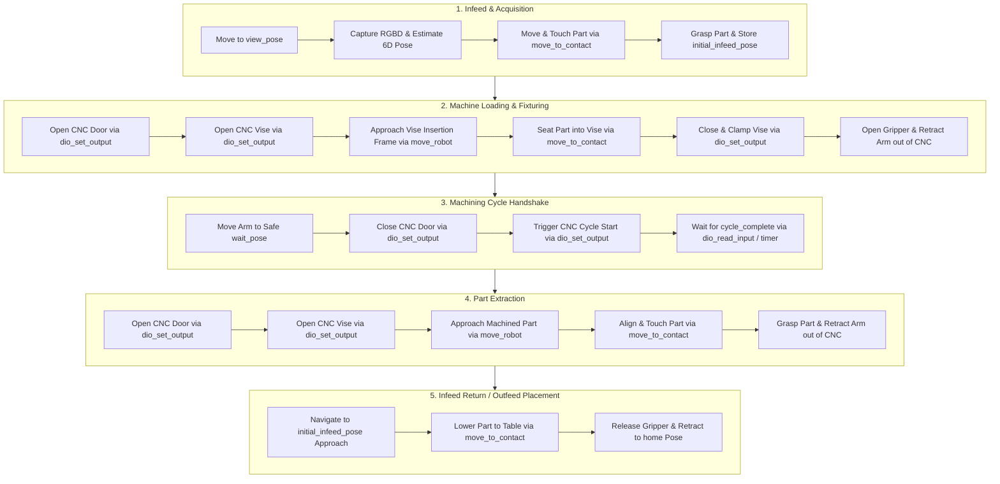

# Open Machine Tending Solution (OMTS)

OMTS is an open-source reference application for automated machine tending (e.g. CNC milling, turning, press braking, and fixture loading) built on top of **Intrinsic Open Core (IOC)** using the **Solution Building Language (SBL)** Python SDK.

---

## 1. Solution Architecture & Execution Pipeline

OMTS orchestrates a complete 13-step machine tending cycle. It features a dual-infeed strategy supporting either **Vision-Guided Pick** (random part placement via 3D camera pose estimation) or **Blind Grid Pick** (deterministic pallet slot math).



---

## 2. 13-Step Execution Sequence

1. **Perception Acquisition:** Move robot to `view_pose`, capture point cloud/RGBD image with 3D camera (Orbbec Gemini 335Le), and estimate raw stock 6D pose (or fallback to grid slot index).
2. **Part Grasping:** Move arm toward raw stock, perform compliant touchdown via `move_to_contact`, close gripper, and store `initial_infeed_pose`.
3. **Open CNC Door:** Assert digital output pin via `dio_set_output`.
4. **Open CNC Vise:** Assert digital output pin via `dio_set_output`.
5. **Vise Insertion:** Move robot into CNC enclosure and seat part against vise backstops using `move_to_contact`.
6. **Clamp Vise:** Close and clamp CNC vise via `dio_set_output`.
7. **Standby Move:** Open gripper, retract arm outside CNC enclosure, and move to `wait_pose`.
8. **Close CNC Door:** Assert digital output pin via `dio_set_output`.
9. **Machining Execution:** Assert cycle start signal and monitor `dio_read_input` for cycle completion.
10. **Open CNC Door:** Assert digital output pin upon cycle completion.
11. **Unclamp Vise:** Open CNC vise via `dio_set_output`.
12. **Part Extraction:** Approach machined part, align via `move_to_contact`, close gripper, and retract cleanly out of CNC enclosure.
13. **Return to Infeed:** Transfer finished part back to `initial_infeed_pose`, lower to surface via `move_to_contact`, release gripper, and return to `home`.

---

## 3. Repository Layout

```
omts/
├── .bazelrc                             # Compiler flags, toolchains, and CUDA settings
├── .bazelversion                        # Pinned Bazel version (8.x)
├── MODULE.bazel                         # Bzlmod dependencies (insrc/ioc, toolchains, Skylib)
├── BUILD                                # Defines intrinsic_solution(:omts) & robot model flags
│
├── configs/                             # Workcell Textproto / Pbtxt configurations
│   ├── icon_config.textproto            # ICON mainloop controller configuration
│   ├── ur_module_config.textproto       # Universal Robots hardware module config
│   ├── gemini_device_config.textproto   # Orbbec Gemini 335Le camera config
│   └── motion_planner_config.textproto  # Motion planning & collision checking config
│
├── assets/                              # 3D models, meshes, and catalog assets
│   ├── meshes/                          # STL / GLB meshes (trays, CNC enclosure, raw stock)
│   └── raw_stock/                       # Raw stock metadata and bounding geometry
│
├── src/                                 # Main OMTS Python package
│   ├── main.py                          # Main OMTS application entrypoint
│   ├── core/                            # Domain models (Workpiece, Tray, WorkcellState)
│   ├── hardware/                        # Hardware adapters (Robot, Gripper, CNC Machine, Camera)
│   ├── behaviors/                       # Composable Behavior Tree subtrees & tasks
│   └── utils/                           # Math, coordinate transforms, and logging utilities
│
├── tools/                               # Developer & operational CLI tools
│   ├── calibration/                     # Camera-to-robot & hand-eye calibration scripts
│   ├── jogging/                         # Interactive robot teleoperation & pose teaching
│   └── world/                           # Scene object import & belief world population
│
└── tests/                               # Test Suites
    ├── unit/                            # Offline unit tests (Mock SBL, tray math, domain state)
    └── e2e/                             # End-to-end simulation tests against Gazebo
```

---

## 4. Object-Oriented Design & SBL Abstractions

OMTS adheres to clean separation of concerns:

- **Domain Models (`src/core/`):** Represents manufacturing state (`Workpiece`, `PartState`, `TraySlot`, `WorkcellState`) independently from robot kinematics.
- **Hardware Adapters (`src/hardware/`):** Unified interfaces (`Robot`, `Gripper`, `Machine`, `VisionSensor`) wrapping low-level SBL gRPC stubs and allowing seamless substitution with mock objects during unit testing.
- **Infeed Strategy Pattern (`src/core/infeed.py`):** Encapsulates part acquisition logic:
  - `PerceptionInfeed`: Uses camera + pose estimation for unstructured / random part placement.
  - `GridInfeed`: Uses mathematical row/column indexing for structured tray pallets.
- **Composable Behavior Trees (`src/behaviors/`):** Modular factory functions returning standard `bt.Node` / `bt.SubTree` building blocks.

---

## 5. Build & Run Instructions

### Deploy & Run Solution

Run OMTS using the default UR5e robot model:
```bash
bazel run //:omts -- --address localhost:17080
```

Run OMTS with the UR3e robot model:
```bash
bazel run //:omts --//:robot_model=ur3e -- --address localhost:17080
```

Compile in optimized mode (`-c opt`):
```bash
bazel run -c opt //:omts --//:robot_model=ur3e -- --address localhost:17080
```

---

## 6. Developer Tools

- **Camera-to-Robot Calibration:**
  ```bash
  bazel run //tools/calibration:calibrate_camera -- --address=localhost:17080
  ```
- **Interactive Robot Jogging & Pose Teaching:**
  ```bash
  bazel run //tools/jogging:jog_interactive -- --address=localhost:17080
  ```
- **Run Unit Tests:**
  ```bash
  bazel test //tests/unit/...
  ```
