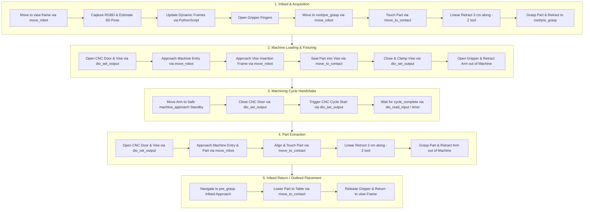

# Open Machine Tending Solution (OMTS)

[](https://github.com/intrinsic-ai/intrinsic-omts/actions/workflows/ci.yml)

OMTS is an open-source reference application for automated machine tending (e.g. CNC milling, turning, press braking, and fixture loading) built on top of **Intrinsic Open Core (IOC)** using the **Solution Building Library (SBL)** Python SDK.

---

## Documentation Guides

* [**Architecture & System Design**](docs/ARCHITECTURE.md): SBL abstractions, behavior tree lifecycle, infeed strategy pattern, and domain models.
* [**Extending Hardware & Real I/O**](docs/EXTENDING_HARDWARE.md): Guide for connecting real Robotiq grippers, pneumatic vises, CNC machine door interlocks, and 3D perception tracking.
* [**Developer Playbook & Operations**](docs/DEVELOPER_PLAYBOOK.md): Bazel execution, unit tests, diagnostic tools (`inspect_world`, `apply_scene_updates`, `move_to_frame`), and troubleshooting gotchas.

---

## 1. Solution Architecture & Execution Pipeline

OMTS orchestrates a complete machine tending cycle. It features a dual-infeed strategy supporting either **Vision-Guided Pick** (random part placement via 3D camera pose estimation) or **Blind Grid Pick** (deterministic pallet slot math).



---

## 2. Repository Layout

```
omts/
├── .bazelrc                             # Compiler flags, toolchains, and CUDA settings
├── .bazelversion                        # Pinned Bazel version (8.x)
├── MODULE.bazel                         # Bzlmod dependencies (ioc, toolchains, Skylib)
├── BUILD                                # Defines intrinsic_solution(:omts_solution) & aliases
│
├── configs/                             # Workcell Textproto / Pbtxt configurations
│
├── assets/                              # 3D models, meshes, and catalog assets
│   ├── meshes/                          # STL / GLB meshes (trays, CNC enclosure, raw stock)
│   └── raw_stock/                       # Raw stock metadata and bounding geometry
│
├── src/                                 # Main OMTS Python package
│   ├── main.py                          # Main OMTS application entrypoint
│   ├── core/                            # Domain models (Workpiece, Tray, WorkcellState)
│   ├── hardware/                        # Hardware adapters (Robot, Gripper, CNC Machine, Camera)
│   ├── behaviors/                       # Composable Behavior Tree subtrees & tasks
│   └── utils/                           # Math & coordinate transform utilities
│
├── tools/                               # Developer & operational CLI tools
│   ├── calibration/                     # Camera-to-robot & hand-eye calibration scripts
│   ├── jogging/                         # Interactive robot teleoperation & pose teaching
│   └── world/                           # Scene updates, transform inspection & alignment
│
└── tests/                               # Test Suites
    ├── unit/                            # Offline unit tests (Mock SBL, tray math, domain state)
    └── e2e/                             # End-to-end simulation tests against Gazebo
```

---

## 3. Object-Oriented Design & SBL Abstractions

OMTS adheres to clean separation of concerns:

- **Domain Models (`src/core/`):** Represents manufacturing state (`Workpiece`, `PartState`, `TraySlot`, `WorkcellState`) independently from robot kinematics.
- **Hardware Adapters (`src/hardware/`):** Unified interfaces (`Robot`, `Gripper`, `Machine`, `VisionSensor`) wrapping low-level SBL gRPC stubs and allowing seamless substitution with mock objects during unit testing.
- **Infeed Strategy Pattern (`src/core/infeed.py`):** Encapsulates part acquisition logic:
  - `PerceptionInfeed`: Uses camera + pose estimation for unstructured / random part placement.
  - `GridInfeed`: Uses mathematical row/column indexing for structured tray pallets.
- **Composable Behavior Trees (`src/behaviors/`):** Modular factory functions returning standard `bt.Node` / `bt.SubTree` building blocks.

---

## 4. Prerequisites & Workspace Setup

For local development, the `omts` workspace expects the exported **`ioc`** repository to be located in an adjacent sibling directory:

```
workspaces/
├── ioc/          # Intrinsic Open Core platform workspace
└── omts/         # OMTS application workspace
```

This dependency is configured in [`MODULE.bazel`](MODULE.bazel) via local path overrides:

```python
bazel_dep(name="insrc", repo_name="ioc")
local_path_override(
  module_name="insrc",
  path="../ioc",
)

bazel_dep(name="intrinsic_apis", version="0.0.1")
local_path_override(
  module_name="intrinsic_apis",
  path="../ioc/incode/intrinsic_apis",
)
```

> [!NOTE]
> Once `ioc` is published to a public Git repository or the Bazel Central Registry (BCR), these `local_path_override` definitions will be replaced with standard remote dependencies or archive overrides.

---

## 5. Build & Run Instructions

### 1. Deploy the Workcell Solution

Deploy and start the ICON controller, robot hardware modules, camera drivers, and platform services:

```bash
# Deploy with default OMTS setup (UR5e + omts camera config):
bazel run //:omts_solution -c opt -- --address localhost:17080

# Deploy with Lab BB-01 setup (UR3e + lab_bb_01 camera config):
bazel run //:omts_solution -c opt --config=lab_bb_01 -- --address localhost:17080
```

### 2. Run the OMTS Python Application

Connect to the running deployment and execute the machine tending sequence:

```bash
# Run in Perception mode (3D vision-guided picking + Robotiq gripper):
bazel run //src:omts_app -- --address=localhost:17080 --infeed_mode=perception --gripper_type=robotiq

# Run in Blind Grid mode (deterministic tray slots):
bazel run //src:omts_app -- --address=localhost:17080 --infeed_mode=grid
```

---

## 6. Testing & Developer Tools

### Unit Tests
Run offline unit tests (no physical cluster or robot required, covers 8 test suites):
```bash
bazel test //tests/unit:all
```

### Developer CLI Tools

- **Apply Scene & Attachment Updates Live (without restarting the solution):**
  ```bash
  # Push all default configs live (ur_module attachments, scene frames, align_robot):
  bazel run //tools/world:apply_scene_updates -- --address=localhost:17080

  # Or apply specific .pbtxt files:
  bazel run //tools/world:apply_scene_updates -- --files configs/scene.updates.pbtxt --address=localhost:17080
  ```

- **Inspect Solution World & Resources:**
  ```bash
  bazel run //tools/world:inspect_world -- --address=localhost:17080
  ```

- **Interactive Joint & Teleop Jogging:**
  ```bash
  bazel run //tools/jogging:jog_interactive -- --host=localhost --port=17080
  ```

- **Move Robot Tool Frame to a Target Scene Frame:**
  ```bash
  # Interactive frame selection menu:
  bazel run //tools/jogging:move_to_frame -- --address=localhost:17080

  # Or move directly to a specified frame:
  bazel run //tools/jogging:move_to_frame -- --address=localhost:17080 --frame=view --motion_type=ANY
  ```

- **Store & Teach Scene Frames (persists & overwrites in scene.updates.pbtxt):**
  ```bash
  # Store current tool_frame pose with specified frame name:
  bazel run //tools/jogging:store_frame -- view --address=localhost:17080

  # Or run interactively to prompt for frame name:
  bazel run //tools/jogging:store_frame -- --address=localhost:17080
  ```

- **Store & Teach Named Joint Configurations:**
  ```bash
  bazel run //tools/jogging:store_joint_config -- home --address=localhost:17080
  ```

- **Sample Poses for Camera-to-Robot Calibration:**
  ```bash
  bazel run //tools/calibration:sample_calibration_poses -- --address=localhost:17080
  ```
  
- **Run Camera-to-Robot Calibration:**
  ```bash
  bazel run //tools/calibration:calibrate_camera -- --address=localhost:17080
  ```

- **Pose Estimation:**
  (More documentation on parameters can be found in `tools/pose_estimation/README.md`)
  ```bash
  bazel run //tools/pose_estimation:register_using_train_service -- \
  --address="localhost:17080" \
  --scene_object_id="ai.intrinsic.scene_object_id" \
  --pose_estimator_id="ai.intrinsic.my_pose_estimator" \
  --refinement_iters=3 \
  --confidence_threshold=0.6 \
  --visibility_threshold=0.6

  bazel run //tools/pose_estimation:run_pose_estimation -- \
  --address="localhost:17080" \
  --pose_estimator_id="ai.intrinsic.my_pose_estimator" \
  --camera_name="orbbec_camera" \
  --sensor_ids="1,4" \
  --service_name="pose_estimator_service" \
  --min_num_instances=1
  ```

---

## 7. Code Quality & Formatting

OMTS enforces formatting and linting checks on all pull requests via GitHub Actions CI. Formatting is enforced as a check rather than auto-applied in CI, ensuring developers retain full control over their code before submitting.

### Local Formatting
Format both Bazel (`buildifier`) and Python (`ruff`) files locally using:

```bash
./tools/format.sh
```

### Local Linting & Pre-PR Verification
Run the exact checks executed in CI before pushing your branch:

```bash
./tools/lint.sh
```

### Git Pre-Commit Hooks (Optional)
If you use [`pre-commit`](https://pre-commit.com/), install hooks to verify or format files automatically upon commit:

```bash
pre-commit install
```