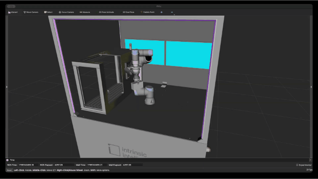
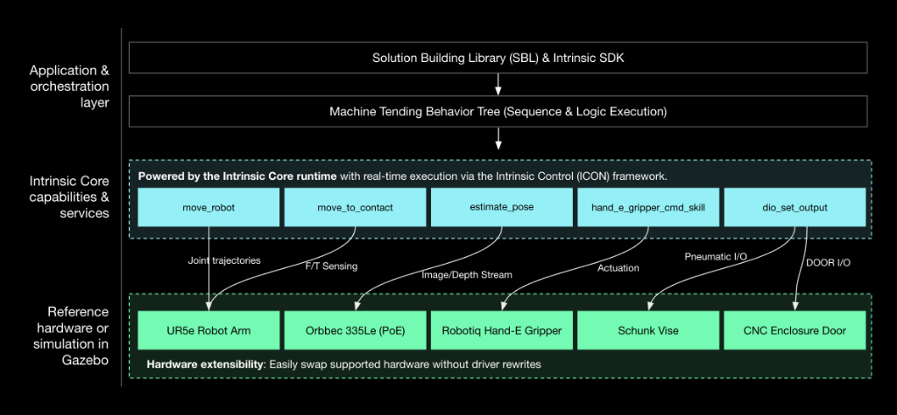
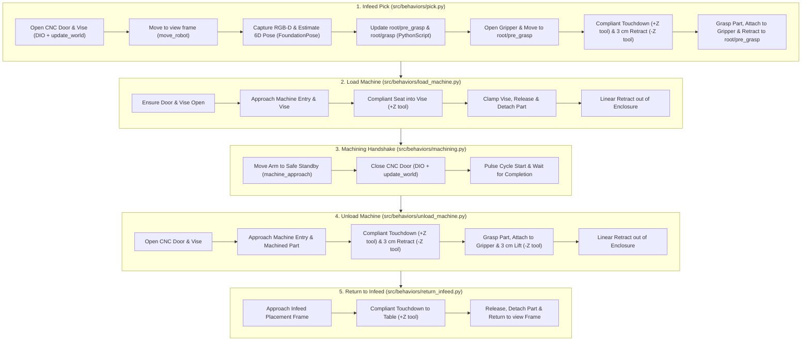

# Open Machine Tending Solution (OMTS)

[](https://github.com/intrinsic-ai/intrinsic-omts/actions/workflows/ci.yml) [](https://github.com/intrinsic-ai/intrinsic-omts/actions/workflows/ci.yml) [](https://www.python.org/) [](LICENSE) [](https://developer.intrinsic.ai) [](https://www.ros.org/) [](.github/workflows/dependabot.yml)

The Open Machine Tending Solution (OMTS) is an open-source reference application for automated machine tending built on [Intrinsic Core™](https://github.com/intrinsic-ai/intrinsic-core) and compatible with ROS to jump-start the development of industrial applications.

<p align="center">
  
</p>

- A functional baseline for a real-world machine shop use case that delivers pre-configured assets, skills, a native digital twin ready to use out of the box.
- Easily customize solutions with hardware-agnostic robot control, making it easy to swap arms, grippers, and sensors without rewriting application code.
- Built-in compatibility with NVIDIA FoundationPose®, providing accurate 6-DoF pose estimation of parts without custom vision pipeline wrappers.
- An open, modular template built for seamless customization across adjacent manufacturing tasks and collaborative open-source contribution.

---

## Installation and setup

See the [Getting Started guide](https://github.com/intrinsic-ai/intrinsic-core/tree/main/developer_resources/learn/tutorials/getting_started.md) for full installation and setup instructions.

---

## High level OMTS architecture

<p align="center">
  
</p>

See [Architecture.md](docs/ARCHITECTURE.md) for more details.

### Components represented in the architecture

#### Behavior tree
The top-level task orchestration engine. Built using the Solution Building Library (SBL), it executes modular behavior trees to coordinate skills, logic branching, and error handling. By decoupling high-level sequence coordination from underlying motion and perception algorithms, it allows developers to modify process logic and recovery routines without touching low-level driver or controller code.

#### Skills and services
- **`move_robot`**: Encapsulates constraint-aware motion planning and real-time control to automatically generate collision-free paths and stream optimized trajectories directly to the robot controller, ensuring smooth, deterministic execution without manual waypoint engineering.
- **`move_to_contact`**: Leverages real-time force/torque feedback to drive compliant, guarded approach motions, automatically arresting or adapting trajectory upon physical contact to ensure safe, damage-free part localization and seating.
- **`estimate_pose`**: Executes GPU-accelerated 6-DoF pose estimation via NVIDIA FoundationPose® to determine accurate workpiece position and orientation directly from camera feeds, enabling robust grasp planning without rigid physical fixturing.
- **`hand_e_gripper_cmd_skill`**: Skill to control the Robotiq Hand-E gripper.
- **`dio_set_output`**: Toggles digital outputs on the I/O controller to automate external hardware signals, such as commanding the CNC machine door to open/close and actuating the vise clamp.

---

## Documentation and resources

- [Architecture & System Design](https://github.com/intrinsic-ai/intrinsic-omts/blob/main/docs/ARCHITECTURE.md): SBL abstractions, behavior tree lifecycle, infeed strategy pattern, and domain models.
- [Extending Hardware & Real I/O](src/hardware/README.md): Guide for connecting real Robotiq grippers, pneumatic vises, CNC machine door interlocks, and 3D perception tracking.
- [Developer Playbook & Operations](tools/README.md): Bazel execution, unit tests, diagnostic tools (`inspect_world`, `apply_scene_updates`, `move_to_frame`), and troubleshooting gotchas.
- [Tutorials](https://github.com/intrinsic-ai/intrinsic-core/tree/main/developer_resources/learn/tutorials): Step-by-step guides to get started, customize physical layouts, visualize the robot, and more.
- [Glossary](https://github.com/intrinsic-ai/intrinsic-core/blob/main/developer_resources/learn/glossary/general_terms.md): Technical definitions of Intrinsic Core and OMTS.
- [Intrinsic developer community](https://developer.intrinsic.ai/): Guides, tutorials, a community forum to ask questions, share projects, and get support, and be the first to hear about new tools and features.

---

## Implementation details

### 1. Solution architecture and execution pipeline

OMTS orchestrates a complete perception-to-manipulation machine tending cycle inside a single SBL `BehaviorTree` wrapped in `bt.Loop` for single-cycle, multi-cycle, or continuous operation. It features a dual-infeed strategy supporting either Vision-Guided Pick (random part placement via 3D camera pose estimation) or Blind Grid Pick (deterministic pallet slot math):



### 2. Repository layout

```text
omts/
├── .bazelrc                             # Compiler flags, toolchains, and CUDA settings
├── .bazelversion                        # Pinned Bazel version (8.x)
├── MODULE.bazel                         # Bzlmod dependencies (@intrinsic-core, @intrinsic_apis)
├── BUILD                                # Defines intrinsic_solution(:omts_solution)
├── configs/                             # Cell YAML configs, .pbtxt updates & service manifests
│   ├── common/                          # Shared service configs & asset manifests
│   ├── omts/                            # Production cell (UR5e, CNC enclosure, Schunk vise)
│   ├── lab_bb_01/                       # Lab cell (UR3e, CAW enclosure, no CNC/vise)
│   └── kr_10/                           # KUKA KR10 placeholder config
├── models/                              # SDF/GLB 3D scene assets & manifests
├── src/                                 # Main OMTS Python package (//src:omts_app)
│   ├── main.py                          # Application CLI entrypoint
│   ├── core/                            # Domain models, infeed strategies & YAML config
│   ├── behaviors/                       # Master Behavior Tree & 5 cycle subtrees
│   ├── hardware/                        # Robot, Gripper, Machine & Vision SBL adapters
│   ├── utils/                           # Dynamic frame calculator & script/math helpers
│   └── foundationpose/                  # Triton config & Bazel MLModel packaging for FoundationPose
├── third_party/                         # C++/CUDA bindings, model.py & deps for FoundationPose
├── tools/                               # Commissioning, calibration, jogging & world CLI tools
└── tests/                               # Offline hermetic unit test suite
```

### 3. Object-oriented design and SBL abstractions

OMTS adheres to clean separation of concerns:

- **Domain Models ([`src/core/`](src/core/))**: Represents manufacturing state (`Workpiece`, `PartState`, `TraySlot`, `WorkcellState`) independently from robot kinematics.
- **Hardware Adapters ([`src/hardware/`](src/hardware/))**: Unified interfaces (`Robot`, `Gripper`, `Machine`, `VisionSensor`) wrapping low-level SBL gRPC stubs and allowing seamless substitution with mock objects during unit testing.
- **Infeed Strategy Pattern ([`src/core/infeed.py`](src/core/infeed.py))**: Encapsulates part acquisition logic:
  - `PerceptionInfeed`: Uses camera + pose estimation for unstructured / random part placement.
  - `GridInfeed`: Uses mathematical row/column indexing for structured tray pallets.
- **Composable Behavior Trees ([`src/behaviors/`](src/behaviors/))**: Modular factory functions returning standard `bt.Node` / `bt.SubTree` building blocks.

### 4. Prerequisites and workspace setup

#### Hardware requirements

- **CPU**: x86-64 architecture (ARM architectures are currently unsupported).
- **GPU**: Integrated graphics minimum (dedicated NVIDIA RTX 3060/4060+ strongly
  recommended for ML/vision workloads).
- **RAM**: 32 GiB DDR4/DDR5 minimum (64 GiB recommended). Note: Build times may
  be impacted if attempting to compile changes at minimum specs while having a
  solution actively running.
- **Storage**: 1 TB NVMe SSD (minimum 100 GB dedicated free space).
- **Networking**: 2–3 Gigabit Ethernet ports (Port 1: LAN/Internet; Port 2:
  Real-time Robot Controller; Optional Port 3: PoE Camera switch).

#### Workspace and dependencies

Bazel fetches **Intrinsic Core** automatically via [`MODULE.bazel`](MODULE.bazel),
so no manual `intrinsic-core` checkout is required:

```python
bazel_dep(name="intrinsic-core")
git_override(
  module_name="intrinsic-core",
  commit=INTRINSIC_CORE_COMMIT,
  remote=INTRINSIC_CORE_REMOTE,
)

bazel_dep(name="intrinsic_apis", version="0.0.1")
git_override(
  module_name="intrinsic_apis",
  commit=INTRINSIC_CORE_COMMIT,
  remote=INTRINSIC_CORE_REMOTE,
  strip_prefix="intrinsic_apis",
)
```

**Git LFS** is required on the host machine because Intrinsic Core stores 3D
meshes, textures, and model weights in Git LFS. Install and enable the smudge
filter globally before building:

```bash
sudo apt-get install git-lfs
git lfs install
```

To move to a different Intrinsic Core revision, update `INTRINSIC_CORE_COMMIT`
in `MODULE.bazel`. The commit behind a release tag can be resolved with:

```bash
git ls-remote https://github.com/intrinsic-ai/intrinsic-core.git 'refs/tags/<tag>^{}'
```

#### GitHub release artifacts

During the build, Bazel automatically downloads the following prebuilt bundles
and model weights from this repository's GitHub Releases (configured in
[`MODULE.bazel`](MODULE.bazel)):

- `flowstate_ros_bridge.bundle.tar`: Prebuilt service of
  [`flowstate_ros_bridge`](https://github.com/intrinsic-ai/sdk-ros/tree/main/flowstate_ros_bridge).
- `hand_e_gripper_service.bundle.tar`: Prebuilt Robotiq Hand-E ROS driver
  service.
- `hand_e_gripper_cmd_skill.bundle.tar`: Prebuilt Robotiq Hand-E control skill.
- `orbbec_gemini_driver.bundle.tar`: Prebuilt driver service of
  [`flowstate_orbbec`](https://github.com/intrinsic-ai/intrinsic-ros-camera-drivers/tree/main/flowstate_orbbec).
- `segmentation.tar.gz`: Pretrained RF-DETR segmentation model.

### 5. Build and run instructions

#### 5.1. Deploy the workcell solution

Build and launch the ICON controller, hardware modules, perception services, and
simulator:

```bash
# Deploy default OMTS cell (UR5e + CNC enclosure + Schunk vise):
bazel run //:omts_solution -c opt -- --address=localhost:17080

# Deploy Lab BB-01 cell (UR3e + CAW enclosure, no CNC machine):
bazel run //:omts_solution -c opt --//:setup=lab_bb_01 -- --address=localhost:17080
```

#### 5.2. Apply scene updates (simulation / fresh deployment)

Push kinematic attachments, robot base alignment, and scene frames to the live
`ObjectWorld` (pass `--reset_sim` to synchronize Gazebo's `sim_world`):

```bash
bazel run //tools/world:apply_scene_updates -- \
  --address=localhost:17080 \
  --reset_sim
```

#### 5.3. Register and verify pose estimator (required before running `omts_app`)

Register the FoundationPose estimator for the raw stock workpiece before
starting the machine tending application:

```bash
bazel run //tools/pose_estimation:register_using_train_service -- \
  --address="localhost:17080" \
  --scene_object_id="ai.intrinsic.raw_stock_2x3x5" \
  --pose_estimator_id="ai.intrinsic.raw_stock_2x3x5_estimator" \
  --refinement_iters=6 \
  --confidence_threshold=0.6 \
  --visibility_threshold=0.6
```

Optionally verify pose detection directly against the live camera feed:

```bash
bazel run //tools/pose_estimation:run_pose_estimation -- \
  --address=localhost:17080 \
  --pose_estimator_id=ai.intrinsic.raw_stock_2x3x5_estimator
```

#### 5.4. Run the OMTS application

Connect to the running deployment and execute the machine tending Behavior Tree:

```bash
# Run with default OMTS cell configuration:
bazel run //src:omts_app -- \
  --address=localhost:17080 \
  --config="configs/omts/app_config.yaml"

# Run with Lab BB-01 cell configuration:
bazel run //src:omts_app -- \
  --address=localhost:17080 \
  --config="configs/lab_bb_01/app_config.yaml"

# Override cycle count (e.g. 3 cycles, or 0 for continuous loop) and execution mode:
bazel run //src:omts_app -- \
  --address=localhost:17080 \
  --config="configs/omts/app_config.yaml" \
  --num_cycles=3 \
  --simulation_mode=fast_preview
```

### 6. Testing and developer tools

#### Unit tests

Run the hermetic unit test suite offline (no running cluster or physical
hardware required):

```bash
bazel test //tests/...
```

#### Operational and diagnostic CLI tools

See [`tools/README.md`](tools/README.md) for the full reference. Common commands:

```bash
# Inspect live world kinematic tree, frames, and joint states:
bazel run //tools/world:inspect_world -- --address=localhost:17080

# Interactive robot jogging:
bazel run //tools/jogging:jog_interactive -- --instance=icon --host=localhost --port=17080

# Move robot tool to a named scene frame:
bazel run //tools/jogging:move_to_frame -- --address=localhost:17080 --frame=view --motion_type=ANY

# Teach & persist current tool pose to scene.updates.pbtxt:
bazel run //tools/jogging:store_frame -- view --address=localhost:17080

# Control gripper (Robotiq or DIO):
bazel run //tools/gripper:control_gripper -- --address=localhost:17080 --action=open

# Control CNC machine doors, vise, and cycle signals:
bazel run //tools/machine:control_machine -- --address=localhost:17080 --action=open_door
```

### 7. Code quality and formatting

OMTS enforces formatting and linting checks on all pull requests via GitHub
Actions CI (`line-length = 80`, `indent-width = 2`):

```bash
# Auto-format Bazel (buildifier) and Python/Markdown (ruff) files:
./tools/format.sh

# Run CI lint and format verification checks locally:
./tools/lint.sh
```

### 8. Licensing information for NVIDIA FoundationPose®

OMTS uses the FoundationPose model by NVIDIA for RGB-D pose estimation.
FoundationPose is packaged into an `MlModelAsset` in
[`src/foundationpose/BUILD`](src/foundationpose/BUILD) and referenced in the
[`BUILD`](BUILD) file at build time by the user. The integration comprises two
components:

1. An orchestration library (`third_party/foundationpose/`) derived from
   NVIDIA's
   [Isaac ROS Pose Estimation Repository](https://github.com/NVIDIA-ISAAC-ROS/isaac_ros_pose_estimation),
   licensed under the Apache 2.0 License. See
   [`src/foundationpose/README.md`](src/foundationpose/README.md) for Bazel
   build and packaging details.
2. The FoundationPose model weights (`.onnx` files) are not included in this
   repository and are not covered by the Apache 2.0 License. They are downloaded
   at build time directly from NVIDIA's NGC catalog by the user (configured in
   [`third_party/foundationpose/deps.bzl`](third_party/foundationpose/deps.bzl)):
   - [refine_model.onnx](https://api.ngc.nvidia.com/v2/models/nvidia/isaac/foundationpose/versions/1.0.0_onnx/files/refine_model.onnx)
   - [score_model.onnx](https://api.ngc.nvidia.com/v2/models/nvidia/isaac/foundationpose/versions/1.0.0_onnx/files/score_model.onnx)
   - License: [NVIDIA Open Model License](https://www.nvidia.com/en-us/agreements/enterprise-software/nvidia-open-model-license/).

By building this project, you download the model weights directly from NVIDIA
and accept the NVIDIA Open Model License for those weights. Intrinsic does not
distribute these weights.

---

## Contributing and community

Contributions are welcome! Please review:

* [CONTRIBUTING.md](CONTRIBUTING.md): Details on signing the Google Contributor License Agreement (CLA), community guidelines, C++20 coding standards, and pull request workflows.  
* [SECURITY.md](SECURITY.md): Instructions for reporting security vulnerabilities.

---

## License

This project is licensed under the [Apache 2.0 License](LICENSE).

---

> **Disclaimer**: This is not an officially supported Google product.

---

### Trademark notice

"Intrinsic" and "Intrinsic Core" are trademarks of Intrinsic Innovation LLC. See [TRADEMARK.md](TRADEMARK.md) for usage guidelines.
