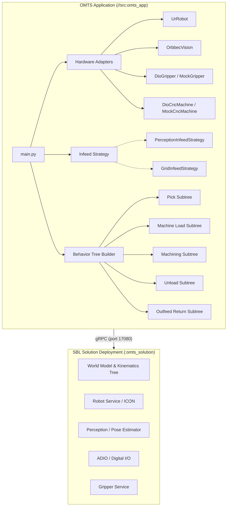
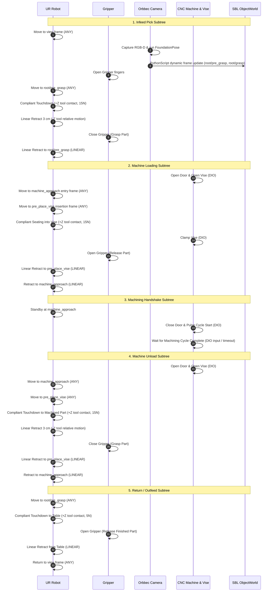
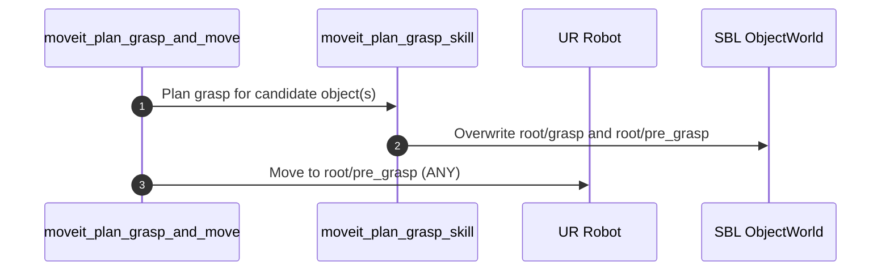

# OMTS Architecture & System Design

The Open Machine Tending Solution (OMTS) is an open-source reference application for CNC machine tending, press braking, and fixture loading built on **Intrinsic Open Core (IOC)** using the **Solution Building Library (SBL)** Python SDK.

---

## 1. System Overview & Lifecycle

OMTS separates deployment packaging from application logic:

* **Solution Package (`//:omts_solution`):** Declares hardware devices (Universal Robots arm, Robotiq gripper, Orbbec camera), resources, skills, and configuration files deployed as a microservice cluster or local container.
* **Application Binary (`//src:omts_app`):** Connects to the solution deployment via gRPC (`deployments.connect(address=...)`), instantiates hardware adapters, configures infeed strategies, builds a composable Behavior Tree (BT), and executes the machine tending cycle.

---

## 2. Hardware Abstraction Layer (HAL)

All hardware interactions are mediated by abstract interfaces in [`src/hardware/`](../src/hardware/):

| Interface | Implementations | Key Responsibilities |
| :--- | :--- | :--- |
| [`RobotInterface`](../src/hardware/robot.py) | `UrRobot`, `MockRobot` | Joint motions (`build_move_joint_task`), absolute Cartesian motions (`build_move_cartesian_task`), relative linear Cartesian motions (`build_move_relative_cartesian_task`), and compliant contact (`build_move_to_contact_task`). |
| [`GripperInterface`](../src/hardware/gripper.py) | `DioGripper`, `RobotiqGripper`, `MockGripper` | Gripper open/close tasks and stroke position control. |
| [`CncMachineInterface`](../src/hardware/machine.py) | `DioCncMachine`, `MockCncMachine` | Door actuation, pneumatic vise clamping, cycle start pulsing, and cycle complete waiting. |
| [`VisionInterface`](../src/hardware/vision.py) | `OrbbecVision`, `MockVision` | RGB-D image acquisition, 6D pose estimation, and in-tree dynamic frame calculation via `bt.PythonScript`. |

This abstraction ensures that high-level process behavior trees remain decoupled from the underlying hardware interfaces, facilitating offline unit testing without real hardware or simulators.

Third-party integrations may add their own adapters without joining this table. [`MoveItGraspPlannerInterface`](../third_party/intrinsic_moveit/moveit_grasp_planner.py) is one: it consumes `RobotInterface` but is not part of the first-party HAL, and nothing here depends on it. See [`third_party/README.md`](../third_party/README.md).

---

## 3. Infeed Strategies (Strategy Pattern)

Infeed handling is decoupled into interchangeable strategy classes in [`src/core/infeed.py`](../src/core/infeed.py):

### A. Vision-Guided Infeed (`PerceptionInfeedStrategy`)
* Used for raw workpieces placed arbitrarily on the infeed table or tray.
* Moves robot to a calibrated `view` frame.
* Triggers a 3-step Behavior Tree perception pipeline:
  1. `capture_images`: Captures synchronized RGB-D frames from the camera.
  2. `estimate_pose_multi_view`: Runs FoundationPose inference connected to the `pose_estimator_service`.
  3. `bt.PythonScript`: Dynamically calculates grasp geometry and updates ObjectWorld frames.
* **In-Tree Frame Calculation & Clean Script Injection:**
  * Logic is maintained as a standard typed module in [`src/utils/dynamic_frame_calculator.py`](../src/utils/dynamic_frame_calculator.py) and injected via [`src/utils/script_utils.py:load_python_script`](../src/utils/script_utils.py).
  * Resolves live camera sensor transform in root (`world.get_transform(parent_obj, camera_sensor_node)`).
  * Computes part pose in root: $\mathbf{T}_{\text{root} \to \text{target}} = \mathbf{T}_{\text{root} \to \text{camera}} \cdot \mathbf{T}_{\text{camera} \to \text{target}}$.
  * **Short-Side Grasp Alignment:** Identifies the workpiece horizontal longest axis ($\theta_{\text{longest}}$) and sets tool yaw $\psi = \theta_{\text{longest}}$ to grasp along the short side.
  * **Geodesic Orientation Optimization:** Evaluates the 4 symmetrically equivalent grasp quaternions for parallel-jaw grippers ($\mathbf{q}$, $-\mathbf{q}$, $\mathbf{q} \cdot \mathbf{R}_z(180^\circ)$, $-\mathbf{q} \cdot \mathbf{R}_z(180^\circ)$) and selects the candidate closest to current tool orientation to prevent wrist joint 6 wrapping and protective stops.
  * Dynamically updates or creates `root/pre_grasp` (with standoff) and `root/grasp` in the SBL `ObjectWorld`.

### B. Blind Grid Pallet Infeed (`GridInfeedStrategy`)
* Used for structured part pallets, blister packs, or fixtures.
* Computes deterministic slot coordinates:
  $$\mathbf{p}_{\text{slot}}(i) = \mathbf{p}_{\text{origin}} + (\text{row} \cdot \Delta_y) + (\text{col} \cdot \Delta_x)$$
* Iterates sequentially across available slots without requiring perception.

---

## 4. Master Machine Tending Cycle

The master Behavior Tree assembled in [`src/behaviors/machine_tending_bt.py`](../src/behaviors/machine_tending_bt.py) executes the complete machine tending cycle across 5 modular subtrees:

---

## 5. Standalone Behavior Subtrees

Not every subtree belongs to the master cycle. [`third_party/intrinsic_moveit/moveit_grasp_planning.py`](../third_party/intrinsic_moveit/moveit_grasp_planning.py) builds a self-contained grasp planning and approach sequence, driven by [`//third_party/intrinsic_moveit/tools:moveit_plan_grasp_and_move`](../third_party/intrinsic_moveit/tools/moveit_plan_grasp_and_move.py). It is a **third-party integration** and requires [intrinsic-moveit](https://github.com/intrinsic-ai/intrinsic-moveit) to have been integrated first:

It approaches the pre-grasp and stops there without descending to the grasp pose, which makes it safe to run repeatedly while validating part reachability and grasp planning across different scene locations (e.g. tabletop surface vs. inside the CNC vice). The touchdown, compliant contact, gripper grasp, and retreat motions belong to `pick.py`, where the physical gripper and real workcell operations are in the loop.

