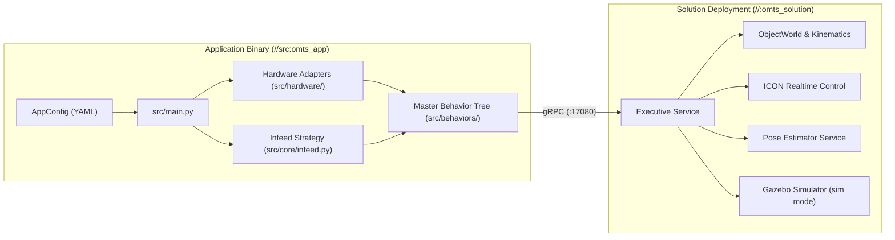
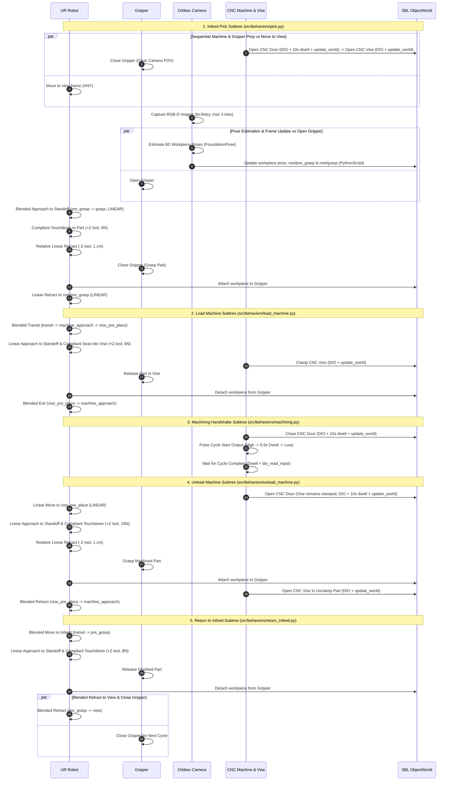

# OMTS System Architecture & Design

The Open Machine Tending Solution (OMTS) is a reference implementation for
automated CNC machine tending, fixture loading, and vision-guided manipulation
built on **Intrinsic Core** and the **Solution Building Library (SBL)**
Python SDK.

---

## 1. System Boundary & Lifecycle

OMTS strictly separates deployment packaging from application orchestration:

* **Solution Package (`//:omts_solution`)**: Declares hardware modules (Universal
  Robots arm, Robotiq Hand-E / DIO gripper, Orbbec Gemini 335Le camera, ADIO),
  scene models (`models/`), perception services (FoundationPose + RF-DETR), and
  cell world updates (`configs/<cell>/*.updates.pbtxt`). Parameterized at build
  time via `--//:setup=omts` or `--//:setup=lab_bb_01`.
* **Application Binary (`//src:omts_app`)**: Connects to the running solution
  over gRPC (`deployments.connect(address=...)`), validates a cell YAML
  configuration (`configs/<cell>/app_config.yaml`), instantiates stateless
  hardware adapters, builds a single master `bt.BehaviorTree`, and executes it
  via `solution.executive.run(tree)`.

---

## 2. Architectural Invariants

1. **Single-Tree Behavior Tree Orchestration**:
   The entire machine tending process executes inside one `bt.BehaviorTree`
   submitted in a single `solution.executive.run(tree)` call. Multi-cycle or
   continuous operation wraps the 5-subtree sequence in `bt.Loop(max_times=N,
   do_child=...)` (`max_times > 1` for finite cycles, `max_times = 0` for
   continuous operation).
2. **Strict Typed YAML Configuration**:
   Cell parameters live in `configs/<cell>/app_config.yaml` and parse into
   frozen dataclasses (`AppConfig`, `RobotConfig`, `GripperConfig`,
   `MachineConfig`, `VisionConfig`, `FramesConfig`, `CycleConfig`). Missing
   required keys fail immediately with `KeyError`.
3. **Optional Hardware Subsystems Across Cells**:
   `AppConfig.machine` is `MachineConfig | None`. Cells with a CNC enclosure
   and pneumatic vise (`omts`) define `machine:`; cells without CNC hardware
   (`lab_bb_01`) omit it, and all behavior subtrees automatically omit door,
   vise, and cycle handshake nodes.
4. **Segment-Scoped Collision Safety**:
   `disable_collision_checking` is never enabled globally. Contact and
   close-proximity motions attach targeted `CollisionRule` exclusions (e.g.
   excluding `[gripper, raw_stock_2x3x5]` during compliant retract, or
   `[(gripper, schunk_egp_64nnb), (raw_stock_2x3x5, schunk_egp_64nnb)]` during
   vise insertion/extraction) while preserving full arm collision checking.
5. **Sequential World Updates (`lock_the_universe`)**:
   The `ai.intrinsic.update_world` skill reserves the entire world state
   (`lock_the_universe: true`). Door and vise actuation tasks (which sync belief
   world joint states via `update_world`) always execute sequentially in a
   `bt.Sequence` prior to `move_robot` tasks to avoid `StatusCode: 18201`
   resource reservation conflicts.
6. **Capability-Filtered ADIO Resolution**:
   `resolve_adio_resource()` verifies `"Icon2AdioPart" in handle.types` before
   binding an explicit ADIO resource slot, allowing the SDK to auto-select the
   compatible ADIO provider when `ur_module` only exposes calibration services.
7. **Belief World vs. Gazebo Simulation World**:
   `//tools/world:apply_scene_updates` writes transforms to the Belief World
   (`world`). When running in simulation, passing `--reset_sim` invokes
   `solution.simulator.reset()` to clone the updated Belief World into Gazebo's
   `sim_world`.

---

## 3. Perception & Dynamic Grasp Synthesis

During vision-guided infeed (`OrbbecVision.build_capture_image_task`,
`build_estimate_pose_task`, and `build_update_grasp_frames_task`):

1. **`capture_images`**: Captures synchronized RGB and Depth frames from the
   wrist-mounted Orbbec camera (`sensor_ids: [1, 4]`) wrapped in `bt.Retry`.
2. **`estimate_pose_multi_view`**: Runs FoundationPose inference via
   `pose_estimator_service`, returning the 6D part pose in the camera optical
   frame (`T_camera_target`) while the gripper opens in parallel.
3. **Dynamic Frame Calculator (`bt.PythonScript`)**:
   Injected from [`src/utils/dynamic_frame_calculator.py`](../src/utils/dynamic_frame_calculator.py)
   via [`load_python_script()`](../src/utils/script_utils.py) with pure-stdlib
   `preludes=(math_utils,)`:
   * Queries live camera extrinsics in `root` and computes the world target pose
     (`T_root_target = T_root_camera @ T_camera_target`).
   * Enforces the minimum height safety bound (`z_target >= min_safe_z`).
   * Updates the active workpiece object pose (`raw_stock_2x3x5`) in
     `ObjectWorld` via `world.update_transform`.
   * Projects the workpiece horizontal axes onto the world XY plane to find
     the longest axis angle (`theta_longest`) and aligns the gripper yaw
     (`psi = theta_longest`) across the short side.
   * Evaluates all 4 symmetrically equivalent parallel-jaw grasp quaternions
     (`+q1`, `-q1`, `+q2`, `-q2`) and selects the candidate maximizing
     `|dot(q_i, q_tool)|` to minimize wrist joint rotation in SO(3).
   * Updates `root/pre_grasp` (offset vertically by `+approach_offset_z`) and
     `root/grasp` in the SBL `ObjectWorld`.

---

## 4. Master Machine Tending Sequence

---

## 5. Runtime Diagnostics & Troubleshooting

| Error Code / Symptom | Root Cause | Resolution |
| :--- | :--- | :--- |
| `ai.intrinsic.move_robot:10301` (`IK solver couldn't find any solutions`) | Camera unparented in world (`orbbec_camera` attached to `root` at `[0,0,0]`) or target frame outside reachable envelope. | Run `bazel run //tools/world:apply_scene_updates -- --address=localhost:17080` to attach `orbbec_camera` to `ur_module/flange`, then inspect with `//tools/world:inspect_world`. |
| `ai.intrinsic.move_to_contact:10301` (`Stabilize action timed out`) | Contact threshold too high or search vector pointing away from surface. | Verify `direction=(0.0, 0.0, 1.0)` in tool frame and check force thresholds in `configs/<cell>/app_config.yaml`. |
| `ai.intrinsic.executive:18201` (Resource reservation conflict) | `update_world` executed concurrently with `move_robot` inside a `bt.Parallel` node. | Keep door/vise actuation (`update_world`) in a sequential `bt.Sequence` before `move_robot`. |
| `ai.intrinsic.executive:13001` (`PROTECTIVE_STOP`) | Robot exceeded wrench limits or wrist joint 6 wrapped during approach. | Clear protective stop on teach pendant; ensure compliant `move_to_contact` is used for surface seating and geodesic quaternion selection is active. |
| `ai.intrinsic.move_robot:10601` (`Frame does not exist`) | Target frame missing from active `ObjectWorld`. | Run `bazel run //tools/world:apply_scene_updates -- --address=localhost:17080` to populate cell scene frames. |
