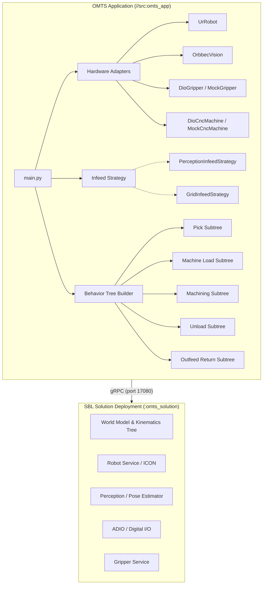
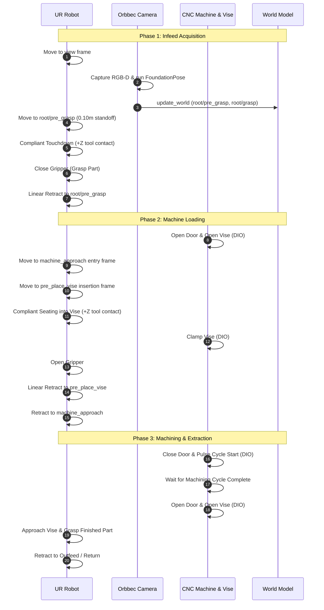

# OMTS Architecture & System Design

The Open Machine Tending Solution (OMTS) is an open-source reference application for CNC machine tending, press braking, and fixture loading built on **Intrinsic Open Core (IOC)** using the **Solution Building Library (SBL)** Python SDK.

---

## 1. System Overview & Lifecycle

OMTS separates deployment packaging from application logic:

* **Solution Package (`//:omts_solution`):** Declares hardware devices (Universal Robots arm, Robotiq gripper, Orbbec camera), resources, skills, and configuration files deployed as a microservice cluster or local container.
* **Application Binary (`//src:omts_app`):** Connects to the solution deployment via gRPC (`deployments.connect(address=...)`), instantiates hardware adapters, configures infeed strategies, builds a composable Behavior Tree (BT), and executes the machine tending cycle.

---

## 2. Hardware Abstraction Layer (HAL)

All hardware interactions are mediated by abstract interfaces in [`src/hardware/`](../src/hardware/):

| Interface | Implementations | Key Responsibilities |
| :--- | :--- | :--- |
| [`RobotInterface`](../src/hardware/robot.py) | `UrRobot`, `MockRobot` | Joint motions (`build_move_joint_task`), Cartesian motions (`build_move_cartesian_task`), and compliant contact (`build_move_to_contact_task`). |
| [`GripperInterface`](../src/hardware/gripper.py) | `DioGripper`, `MockGripper` | Gripper open/close tasks and grasp confirmation. |
| [`CncMachineInterface`](../src/hardware/machine.py) | `DioCncMachine`, `MockCncMachine` | Door actuation, pneumatic vise clamping, cycle start pulsing, and cycle complete waiting. |
| [`VisionInterface`](../src/hardware/vision.py) | `OrbbecVision`, `MockVision` | RGB-D image acquisition, 6D pose estimation, and dynamic world frame updates. |

This abstraction ensures that high-level process behavior trees remain decoupled from the underlying hardware interfaces, facilitating offline unit testing without real hardware or simulators.

---

## 3. Infeed Strategies (Strategy Pattern)

Infeed handling is decoupled into interchangeable strategy classes in [`src/core/infeed.py`](../src/core/infeed.py):

### A. Vision-Guided Infeed (`PerceptionInfeedStrategy`)
* Used for parts placed randomly on the infeed table or tray.
* Moves robot to a calibrated `view` frame.
* Triggers Orbbec RGB-D capture and FoundationPose multi-view inference.
* Dynamically updates `root/pre_grasp` and `root/grasp` via indirect transform updates in `update_world`.
* Moves to dynamic pre-grasp, executes compliant touchdown (`move_to_contact`), grasps the part, and retracts linearly.

### B. Blind Grid Pallet Infeed (`GridInfeedStrategy`)
* Used for structured part pallets, blister packs, or fixtures.
* Computes deterministic slot coordinates:
  $$\mathbf{p}_{\text{slot}}(i) = \mathbf{p}_{\text{origin}} + (\text{row} \cdot \Delta_y) + (\text{col} \cdot \Delta_x)$$
* Iterates sequentially across available slots without requiring perception.

---

## 4. Master Machine Tending Cycle

The master Behavior Tree assembled in [`src/behaviors/machine_tending_bt.py`](../src/behaviors/machine_tending_bt.py) executes the following 13-step sequence:

