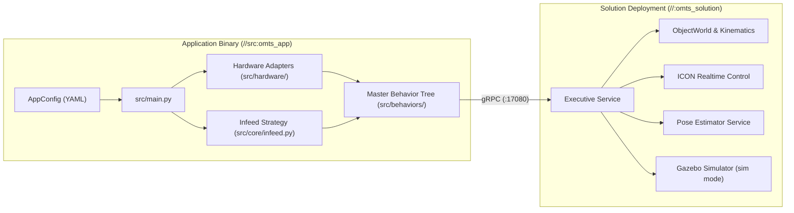
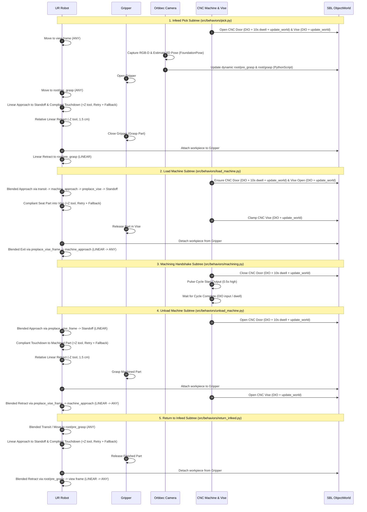

# OMTS System Architecture & Design

The Open Machine Tending Solution (OMTS) is a reference implementation for
automated CNC machine tending, fixture loading, and vision-guided manipulation
built on **Intrinsic Core** and the **Solution Building Library (SBL)**
Python SDK.

---

## 1. System Boundary & Lifecycle

OMTS strictly separates deployment packaging from application orchestration:

* **Solution Package (`//:omts_solution`)**: Declares hardware modules (Universal
  Robots arm, Robotiq Hand-E / DIO gripper, Orbbec Gemini 335Le camera, ADIO),
  scene models (`models/`), perception services (FoundationPose + RF-DETR), and
  cell world updates (`configs/<cell>/*.updates.pbtxt`). Parameterized at build
  time via `--//:setup=omts` or `--//:setup=lab_bb_01`.
* **Application Binary (`//src:omts_app`)**: Connects to the running solution
  over gRPC (`deployments.connect(address=...)`), validates a cell YAML
  configuration (`configs/<cell>/app_config.yaml`), instantiates stateless
  hardware adapters, builds a single master `bt.BehaviorTree`, and executes it
  via `solution.executive.run(tree)`.

```mermaid
flowchart LR
    subgraph App["Application Binary (//src:omts_app)"]
        CFG["AppConfig (YAML)"] --> MAIN["src/main.py"]
        MAIN --> HAL["Hardware Adapters (src/hardware/)"]
        MAIN --> INF["Infeed Strategy (src/core/infeed.py)"]
        HAL --> BT["Master Behavior Tree (src/behaviors/)"]
        INF --> BT
    end

    subgraph Cluster["Solution Deployment (//:omts_solution)"]
        EXEC["Executive Service"]
        WORLD["ObjectWorld & Kinematics"]
        ICON["ICON Realtime Control"]
        PERC["Pose Estimator Service"]
        SIM["Gazebo Simulator (sim mode)"]
    end

    BT -- "gRPC (:17080)" --> EXEC
    EXEC --> WORLD & ICON & PERC & SIM
```

---

## 2. Architectural Invariants

1. **Single-Tree Behavior Tree Orchestration**:
   The entire machine tending process executes inside one `bt.BehaviorTree`
   submitted in a single `solution.executive.run(tree)` call. Multi-cycle or
   continuous operation wraps the 5-subtree sequence in `bt.Loop(max_times=N,
   do_child=...)` (`max_times > 1` for finite cycles, `max_times = 0` for
   continuous operation).
2. **Strict Typed YAML Configuration**:
   Cell parameters live in `configs/<cell>/app_config.yaml` and parse into
   frozen dataclasses (`AppConfig`, `RobotConfig`, `GripperConfig`,
   `MachineConfig`, `VisionConfig`, `FramesConfig`, `CycleConfig`). Missing
   required keys fail immediately with `KeyError`.
3. **Optional Hardware Subsystems Across Cells**:
   `AppConfig.machine` is `MachineConfig | None`. Cells with a CNC enclosure
   and pneumatic vise (`omts`) define `machine:`; cells without CNC hardware
   (`lab_bb_01`) omit it, and all behavior subtrees automatically omit door,
   vise, and cycle handshake nodes.
4. **Segment-Scoped Collision Safety**:
   `disable_collision_checking` is never enabled globally. Contact and
   close-proximity motions attach targeted `CollisionRule` exclusions (e.g.
   excluding `[gripper, raw_stock_2x3x5]` during compliant retract, or
   `[(gripper, schunk_egp_64nnb), (raw_stock_2x3x5, schunk_egp_64nnb)]` during
   vise insertion/extraction) while preserving full arm collision checking.
5. **Sequential World Updates (`lock_the_universe`)**:
   The `ai.intrinsic.update_world` skill reserves the entire world state
   (`lock_the_universe: true`). Door and vise actuation tasks (which sync belief
   world joint states via `update_world`) always execute sequentially in a
   `bt.Sequence` prior to `move_robot` tasks to avoid `StatusCode: 18201`
   resource reservation conflicts.
6. **Capability-Filtered ADIO Resolution**:
   `resolve_adio_resource()` verifies `"Icon2AdioPart" in handle.types` before
   binding an explicit ADIO resource slot, allowing the SDK to auto-select the
   compatible ADIO provider when `ur_module` only exposes calibration services.
7. **Belief World vs. Gazebo Simulation World**:
   `//tools/world:apply_scene_updates` writes transforms to the Belief World
   (`world`). When running in simulation, passing `--reset_sim` invokes
   `solution.simulator.reset()` to clone the updated Belief World into Gazebo's
   `sim_world`.
8. **Resilient Compliant Touchdown (`bt.Fallback` + `bt.Retry`)**:
   In Gazebo simulation, `ai.intrinsic.move_to_contact` (`ActionId.STABILIZE`)
   can fail with `10301` (`"Stabilize action timed out without making contact."`)
   when rigid-body contact forces fail to settle within `SETTLING_TIMEOUT_S`
   (`2.0s`) or when an early force spike triggers `STABILIZE` during descent.
   `create_seated_approach_tasks` (`src/behaviors/motions.py`) wraps every
   `move_to_contact` touchdown in a `bt.Fallback` whose primary try is a
   `bt.Retry(max_tries=2)` node (`recovery` moves linearly back to the unloaded
   standoff pose so `ActionId.TARE` executes in free space) and whose fallback
   try moves linearly to the seated contact pose (`Fallback Linear Seat`) if all
   `move_to_contact` retries time out.

---

## 3. Perception & Dynamic Grasp Synthesis

The grasp backend is selected by `grasp.planner` in the cell config, overridable
with `--grasp_planner`. The default, `cuboid_center`, is described below: its
grasp falls out of the FoundationPose estimate, so the perception pipeline
publishes the grasp frames itself and no separate planning step runs.

During vision-guided infeed (`OrbbecVision.build_perception_and_spawn_task`):

1. **`capture_images`**: Captures synchronized RGB and Depth frames from the
   wrist-mounted Orbbec camera (`sensor_ids: [1, 4]`).
2. **`estimate_pose_multi_view`**: Runs FoundationPose inference via
   `pose_estimator_service`, returning the 6D part pose in the camera optical
   frame (`T_camera_target`).
3. **Dynamic Frame Calculator (`bt.PythonScript`)**:
   Injected from [`src/utils/dynamic_frame_calculator.py`](../src/utils/dynamic_frame_calculator.py)
   via [`load_python_script()`](../src/utils/script_utils.py):
   * Queries live camera extrinsics in `root` and computes the world target pose
     (`T_root_target = T_root_camera @ T_camera_target`).
   * Enforces the minimum height safety bound (`z_target >= min_safe_z`).
   * Then, **only when `publish_grasp_frames` is set** (the `cuboid_center`
     backend):
     * Projects the workpiece horizontal axes onto the world XY plane to find
       the longest axis angle (`theta_longest`) and aligns the gripper yaw
       (`psi = theta_longest`) across the short side.
     * Evaluates all 4 symmetrically equivalent parallel-jaw grasp quaternions
       (`+q1`, `-q1`, `+q2`, `-q2`) and selects the candidate maximizing
       `|dot(q_i, q_tool)|` to minimize wrist joint rotation in SO(3).
     * Updates `root/pre_grasp` (offset vertically by `+approach_z_offset`) and
       `root/grasp` in the SBL `ObjectWorld`.

### Grasp backends

Steps 1-2 and the pose update in step 3 localize the *workpiece* and always run.
Producing the *grasp* on that workpiece is the selectable part:

| Backend | Who writes `root/grasp` / `root/pre_grasp` |
| :--- | :--- |
| `cuboid_center` (default) | The dynamic frame calculator, as described above. Purely geometric: no reachability or collision reasoning. |
| `moveit` | A [`GraspPlannerInterface`](../src/hardware/grasping.py) node, built by [`create_grasp_planner`](../src/hardware/grasp_planners.py), appended after perception. `publish_grasp_frames` is `False`, so the calculator stops at the pose update and the [MoveIt integration](../third_party/intrinsic_moveit/README.md) samples reachable, collision-free candidates instead. |

Exactly one of the two writes those frames on any given run, so a planner
failure can never leave a stale heuristic grasp in the world. Everything
downstream of the pick reads only `root/grasp` and `root/pre_grasp` and is
therefore identical either way.

---

## 4. Master Machine Tending Sequence

```mermaid
sequenceDiagram
    autonumber
    participant Robot as UR Robot
    participant Gripper as Gripper
    participant Vision as Orbbec Camera
    participant CNC as CNC Machine & Vise
    participant World as SBL ObjectWorld

    Note over Robot,World: 1. Infeed Pick Subtree (src/behaviors/pick.py)
    CNC->>World: Open CNC Door (DIO + 10s dwell + update_world) & Vise (DIO + update_world)
    Robot->>Robot: Move to view frame (ANY)
    Vision->>Vision: Capture RGB-D & Estimate 6D Pose (FoundationPose)
    Vision->>World: Update dynamic root/pre_grasp & root/grasp (PythonScript)
    Gripper->>Gripper: Open Gripper
    Robot->>Robot: Move to root/pre_grasp (ANY)
    Robot->>Robot: Linear Approach to Standoff & Compliant Touchdown (+Z tool, Retry + Fallback)
    Robot->>Robot: Relative Linear Retract (-Z tool, 1.5 cm)
    Gripper->>Gripper: Close Gripper (Grasp Part)
    Robot->>World: Attach workpiece to Gripper
    Robot->>Robot: Linear Retract to root/pre_grasp (LINEAR)

    Note over Robot,World: 2. Load Machine Subtree (src/behaviors/load_machine.py)
    CNC->>World: Ensure CNC Door (DIO + 10s dwell + update_world) & Vise Open (DIO + update_world)
    Robot->>Robot: Blended Approach via transit -> machine_approach -> preplace_vise -> Standoff
    Robot->>Robot: Compliant Seat Part into Vise (+Z tool, Retry + Fallback)
    CNC->>World: Clamp CNC Vise (DIO + update_world)
    Gripper->>Gripper: Release Part in Vise
    Robot->>World: Detach workpiece from Gripper
    Robot->>Robot: Blended Exit via preplace_vise_frame -> machine_approach (LINEAR -> ANY)

    Note over Robot,World: 3. Machining Handshake Subtree (src/behaviors/machining.py)
    CNC->>World: Close CNC Door (DIO + 10s dwell + update_world)
    CNC->>CNC: Pulse Cycle Start Output (0.5s high)
    CNC->>CNC: Wait for Cycle Complete (DIO input / dwell)

    Note over Robot,World: 4. Unload Machine Subtree (src/behaviors/unload_machine.py)
    CNC->>World: Open CNC Door (DIO + 10s dwell + update_world)
    Robot->>Robot: Blended Approach via preplace_vise_frame -> Standoff (LINEAR)
    Robot->>Robot: Compliant Touchdown to Machined Part (+Z tool, Retry + Fallback)
    Robot->>Robot: Relative Linear Retract (-Z tool, 1.5 cm)
    Gripper->>Gripper: Grasp Machined Part
    Robot->>World: Attach workpiece to Gripper
    CNC->>World: Open CNC Vise (DIO + update_world)
    Robot->>Robot: Blended Retract via preplace_vise_frame -> machine_approach (LINEAR -> ANY)

    Note over Robot,World: 5. Return to Infeed Subtree (src/behaviors/return_infeed.py)
    Robot->>Robot: Blended Transit / Move to root/pre_grasp (ANY)
    Robot->>Robot: Linear Approach to Standoff & Compliant Touchdown (+Z tool, Retry + Fallback)
    Gripper->>Gripper: Release Finished Part
    Robot->>World: Detach workpiece from Gripper
    Robot->>Robot: Blended Retract via root/pre_grasp -> view frame (LINEAR -> ANY)
```

---

## 5. Runtime Diagnostics & Troubleshooting

| Error Code / Symptom | Root Cause | Resolution |
| :--- | :--- | :--- |
| `ai.intrinsic.move_robot:10301` (`IK solver couldn't find any solutions`) | Camera unparented in world (`orbbec_camera` attached to `root` at `[0,0,0]`) or target frame outside reachable envelope. | Run `bazel run //tools/world:apply_scene_updates -- --address=localhost:17080` to attach `orbbec_camera` to `ur_module/flange`, then inspect with `//tools/world:inspect_world`. |
| `ai.intrinsic.move_to_contact:10301` (`Stabilize action timed out without making contact`) | Gazebo rigid-body contact force chatter failing to settle during `SETTLING_TIMEOUT_S = 2.0s`, early F/T spike triggering `STABILIZE` during descent, or contact threshold too high. | Handled automatically at runtime by `create_seated_approach_tasks` (`bt.Retry` with linear standoff re-approach recovery + `bt.Fallback` linear seat). If persistent on physical hardware, verify `direction=(0.0, 0.0, 1.0)` in tool frame and check force thresholds in `configs/<cell>/app_config.yaml`. |
| `ai.intrinsic.executive:18201` (Resource reservation conflict) | `update_world` executed concurrently with `move_robot` inside a `bt.Parallel` node. | Keep door/vise actuation (`update_world`) in a sequential `bt.Sequence` before `move_robot`. |
| `ai.intrinsic.executive:13001` (`PROTECTIVE_STOP`) | Robot exceeded wrench limits or wrist joint 6 wrapped during approach. | Clear protective stop on teach pendant; ensure compliant `move_to_contact` is used for surface seating and geodesic quaternion selection is active. |
| `ai.intrinsic.move_robot:10601` (`Frame does not exist`) | Target frame missing from active `ObjectWorld`. | Run `bazel run //tools/world:apply_scene_updates -- --address=localhost:17080` to populate cell scene frames. |
