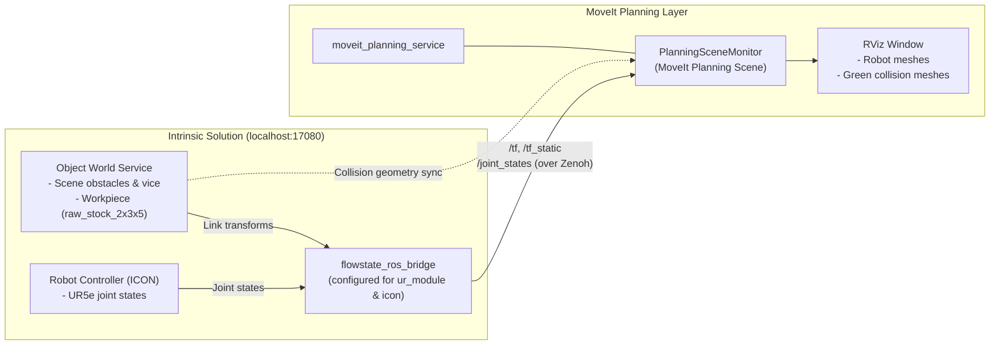
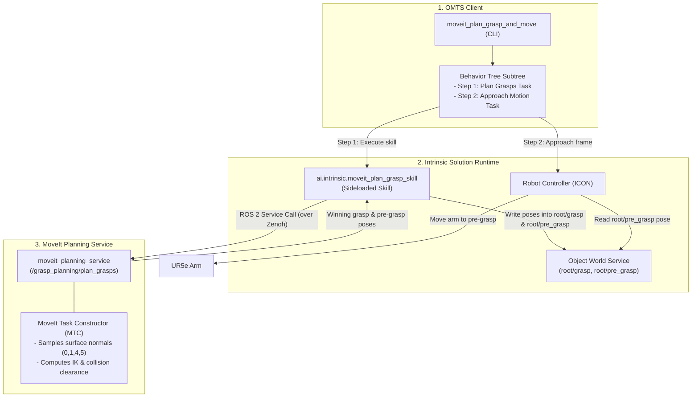

# MoveIt Grasp Planning (third-party integration)

Model-based grasp planning for OMTS, backed by
[`intrinsic-ai/intrinsic-moveit`](https://github.com/intrinsic-ai/intrinsic-moveit)
and MoveIt Task Constructor. Given a part in the Object World, the planning
service enumerates grasp candidates over the part's surfaces, ranks them, and
writes the winner's grasp and pre-grasp poses back into the world. A dedicated
CLI tool drives it for scene bring-up and verification.

> [!IMPORTANT]
> This is **not** part of first-party OMTS and OMTS never deploys it for you.
> Every command below is inert until you have completed the intrinsic-moveit
> integration. If `//:omts_solution` is all you have deployed, start with
> [Setup & Prerequisites](#setup--prerequisites).

Once a first-party grasp planner ships it will become the default and will live
under `src/` and `tools/grasping/` using the unqualified names. Everything here
is named `moveit_*` so the two never have to be told apart by context.

---

## Architecture

The integration connects OMTS behavior orchestration to MoveIt 2 and MoveIt Task Constructor (MTC). To keep components simple and decoupled, the architecture is divided into two distinct flows:
1. **Planning Scene Synchronization**: How the robot state and world objects are streamed into MoveIt in real time.
2. **Grasp Planning & Execution**: How OMTS requests grasps, updates the world, and executes approach motions.

### 1. Planning Scene Synchronization

MoveIt needs an accurate, live view of the robot and surrounding obstacles. The `flowstate_ros_bridge` continuously streams robot joint states and transform frames, while collision geometries from the Object World Service are synchronized into MoveIt's `PlanningSceneMonitor`.



- **Robot Transforms & Joints**: `flowstate_ros_bridge` streams `/tf`, `/tf_static` (anchored at `ur_module/base_link`), and `/joint_states` to ROS 2 over Zenoh.
- **Collision Objects**: Object geometries from the Object World Service (such as tables, the CNC vice, and workpieces) are converted into MoveIt collision objects and displayed as green meshes in RViz.

---

### 2. Grasp Planning & Approach Execution

When planning a grasp, OMTS does not directly move the robot through MoveIt. Instead, it runs a two-step Behavior Tree:
1. **Plan Grasps**: Call the planning service via `ai.intrinsic.moveit_plan_grasp_skill` and save the resulting poses to the Object World Service (`root/grasp` and `root/pre_grasp`).
2. **Approach Pre-Grasp**: Move the arm to the pre-grasp pose using native OMTS Cartesian motion primitives.



- **Decoupled Hand-off**: The planning skill only updates poses in the Object World; it never commands motors directly.
- **Native OMTS Motion**: The arm motion uses first-party OMTS Cartesian moves ([`create_move_to_frame_task`](../../src/behaviors/motions.py)), keeping first-party OMTS independent of ROS 2.

---

## Layout

| Path | Role |
| :--- | :--- |
| [`moveit_grasp_planner.py`](./moveit_grasp_planner.py) | `MoveItGraspPlannerInterface` and its `MoveItGraspPlanner` / `MockMoveItGraspPlanner` implementations; surface constants. |
| [`moveit_grasp_planning.py`](./moveit_grasp_planning.py) | `build_moveit_grasp_planning_subtree` — plan a grasp, then approach the resulting pre-grasp. |
| [`tools/moveit_plan_grasp_and_move.py`](./tools/moveit_plan_grasp_and_move.py) | CLI tool to plan a grasp on target workpiece(s) and move the arm to pre-grasp. |
| [`tests/`](./tests/) | Offline unit tests for grasp planning subtree and CLI argument parsing. |

The integration borrows exactly two things from first-party OMTS:
`//src/hardware:robot` (for `RobotInterface` and `UrRobot`) and
`//src/behaviors:motions` (for the approach move). Nothing first-party depends
on anything here.

---

## Setup & Prerequisites

Users will also need to set up a ROS colcon workspace that has `intrinsic-moveit` built. See [`intrinsic-moveit`](https://github.com/intrinsic-ai/intrinsic-moveit) for the setup instructions.

In order for the integration to work, we will need to reconfigure OMTS's running `flowstate_ros_bridge` service. The detailed configurations required can be found [here](https://github.com/intrinsic-ai/intrinsic-moveit/blob/main/docs/flowstate_ros_bridge_configuration.md).

### 1. Reconfigure `flowstate_ros_bridge`

```bash
# Download the required binaries
cd ~/Downloads/
gh release download v0.0.2 -R intrinsic-ai/intrinsic-moveit \
  -p "moveit_plan_grasp_skill.bundle.tar" \
  -p "flowstate_ros_bridge_config.binarypb"

# Stop flowstate_ros_bridge
inctl service delete --address localhost:17080 flowstate_ros_bridge

# Restart flowstate_ros_bridge with the config
inctl service add --address localhost:17080 ai.intrinsic.flowstate_ros_bridge \
  --config ~/Downloads/flowstate_ros_bridge_config.binarypb
```

### 2. Install the Grasp Planning Skill

We will also need the `moveit_plan_grasp_skill` which can be called from OMTS, and interacts with the `moveit_planning_service` to obtain pre-grasps and grasps:

```bash
# Install the planning skill
inctl asset install --address localhost:17080 \
  ~/Downloads/moveit_plan_grasp_skill.bundle.tar
```

### 3. Ensure Output Frames Exist in the World

The grasp skill only updates pre-existing frames; it never creates them. Make sure `root/grasp` and `root/pre_grasp` are declared in your world (from [`configs/omts/scene.updates.pbtxt`](../../configs/omts/scene.updates.pbtxt)):

```bash
bazel run //tools/world:apply_scene_updates -- --address=localhost:17080
```

### 4. Start `moveit_planning_service`

We can now start the `moveit_planning_service`:

```bash
# These commands are generally required for all terminals running ROS
source <path-to-workspace>/install/setup.bash
export RMW_IMPLEMENTATION=rmw_zenoh_cpp
export ZENOH_CONFIG_OVERRIDE='mode="client";connect/endpoints=["tcp/127.0.0.1:7447"]'

# Start the service
ros2 launch moveit_planning_service service.launch.py headless:=false \
  start_service_status_monitor:=false
```

### 5. Verify Scene Synchronization in RViz

Once the planning service launches, verify that the additional RViz window opens:
- The robot is represented by its meshes.
- All other objects in the scene are propagated as collision objects and represented as green meshes.

The state of the robot and objects are synchronized with the MoveIt planning scene. This can be verified with:

```bash
# Jogging the robot, see tutorial "Jog the robot"
bazel run //tools/jogging:jog_interactive -- \
  --host=localhost \
  --port=17080 \
  --instance=icon

# Updating the scene, see tutorial "Cell customization"
bazel run //tools/world:apply_scene_updates -- \
  --address localhost:17080 \
  --files configs/omts/raw_stock_in_vice.updates.pbtxt

# Resetting the scene, see tutorial "Cell customization"
inctl world reset --address localhost:17080
```

---

## Tutorial Workflow: Planning & Approaching Grasps

We can run `moveit_plan_grasp_and_move` to plan for each object and optionally move the robot to the pre-grasp frame.

The tool stops at the pre-grasp and does not descend to the grasp pose, so the
workpiece is untouched and the gripper is never commanded. This makes it safe
to run repeatedly while validating that the part is plannable and reachable
before executing real picks in [`src/behaviors/pick.py`](../../src/behaviors/pick.py).

```bash
# Dry run: plan a grasp on raw_stock_2x3x5 without moving the arm
bazel run //third_party/intrinsic_moveit/tools:moveit_plan_grasp_and_move -- \
  --address=localhost:17080 \
  --target_object=raw_stock_2x3x5 \
  --plan_only \
  --surfaces=0,1,4,5

# Plan and approach the pre-grasp on the table surface
bazel run //third_party/intrinsic_moveit/tools:moveit_plan_grasp_and_move -- \
  --address=localhost:17080 \
  --target_object=raw_stock_2x3x5 \
  --surfaces=0,1,4,5

# Optionally, reset the scene such that the trajectory to the CNC Vice is shorter
# inctl world reset --address localhost:17080

# Relocate Workpiece to the CNC Vice
bazel run //tools/world:apply_scene_updates -- \
  --address=localhost:17080 \
  --files configs/omts/raw_stock_in_vice.updates.pbtxt

# Plan again to grasp the workpiece that is in the vice now
# This planning step may take longer due to the length of the trajectory if the
# world has not been reset
bazel run //third_party/intrinsic_moveit/tools:moveit_plan_grasp_and_move -- \
  --address=localhost:17080 \
  --target_object=raw_stock_2x3x5 \
  --surfaces=0,1,4,5
```

---

<a id="why-surfaces-0145"></a>
## Why `--surfaces=0,1,4,5`

The stock's collision box is `0.0762 0.127 0.0508` m
([`raw_stock_2x3x5.sdf:L31`](../../models/raw_stock_2x3x5/raw_stock_2x3x5.sdf#L31)),
so its **long axis is Y**. That splits the six faces into two groups:

| Surfaces | Face | Size |
| :--- | :--- | :--- |
| `0`, `1` (±X) and `4`, `5` (±Z) | the four **long faces** | 50 × 75 mm |
| `2`, `3` (±Y) | the two **end caps** | 50 × 50 mm |

`0,1,4,5` is exactly "any long face, never an end cap". Approaching a long face
puts the jaws across the block's middle; approaching an end cap grips it by the
tip, leaving 75 mm of part cantilevered out of the gripper. Both are
geometrically reachable — the jaws span 50 mm either way — so the planner will
happily pick an end-cap grasp if it is allowed to, which is why the set has to
be stated rather than left to collision checking to sort out.

This is a property of *this* part, not a general rule: the tools still default
to `all`, which is the right default for stock of unknown shape and orientation.

---

## Tests

These are **not** in `//tests/unit:all`, which stays first-party:

```bash
bazel test //third_party/intrinsic_moveit/tests:all
```

They run fully offline against `MockMoveItGraspPlanner` and `MockRobot`; no
cluster, robot or planning service is required.

---

## Troubleshooting

| Error Code / Message | Root Cause | Resolution |
| :--- | :--- | :--- |
| `moveit_plan_grasp_skill: Robot model does not define the required end-effector or IK frame` | `--tool_frame_name` or `--end_effector_group` names something absent from the SRDF. Note `hande_tcp`, `hande_tool_frame` and `tool_frame` are all valid coincident aliases, so this is usually a typo or a hardware description that lacks the alias links. | Check the `hand` group in `robot_hardware.srdf` and pass a link listed there. |
| `moveit_plan_grasp_skill: Output pregrasp frame could not be resolved in World Service` | The skill only updates pre-existing frames; it never creates them. | Run `bazel run //tools/world:apply_scene_updates` so `root/grasp` and `root/pre_grasp` exist before planning. |
| `moveit_plan_grasp_skill: Target object was not found in the planning scene` | The part was moved moments before planning and the MoveIt scene has not caught up, or the object name does not resolve. | Raise `--settle_sec`, and confirm the name with `bazel run //tools/world:inspect_world`. |
| `moveit_plan_grasp_skill: No reachable or collision-free grasp candidates found` | The surface set is too narrow for how the part is currently lying, the part is out of reach or occluded, or the candidate set is too coarse. | Widen `--surfaces` — `all` is the widest, and `0,1,4,5` is the demo's set. Confirm reachability with `bazel run //tools/world:inspect_world`. |
| A part that used to work now finds no candidates, or its pre-grasp is unreachable | The part, including when placed in the vice, plans and approaches with `--surfaces=0,1,4,5` and default retraction. A new failure usually means the part moved, the scene drifted, or the arm is starting from an awkward pose. | Reset the world with `inctl world reset --address localhost:17080`, re-apply the position updates, and re-check the pose with `bazel run //tools/world:inspect_world`. |
